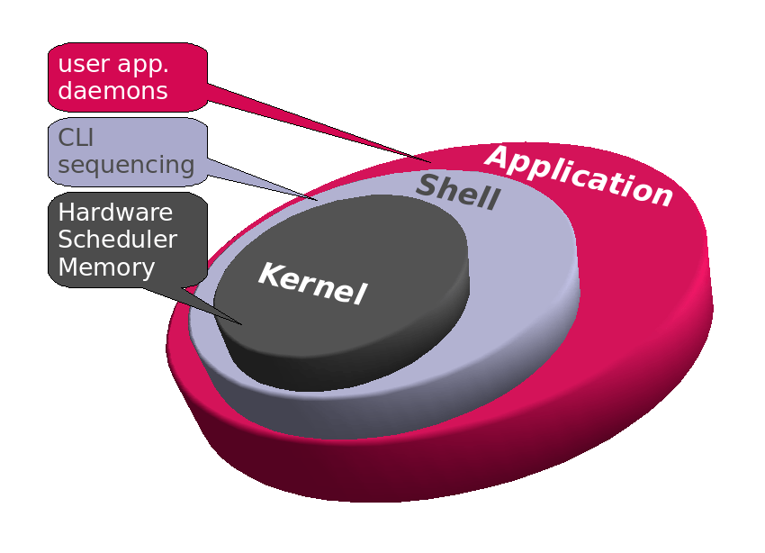
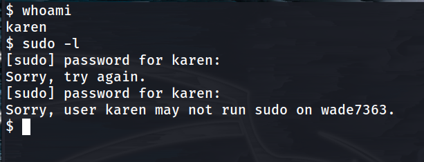
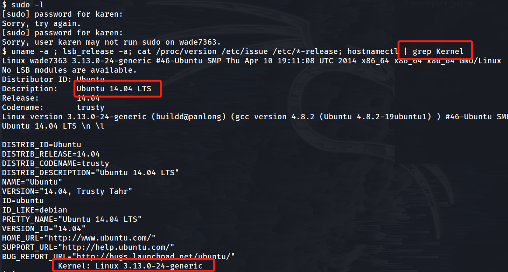
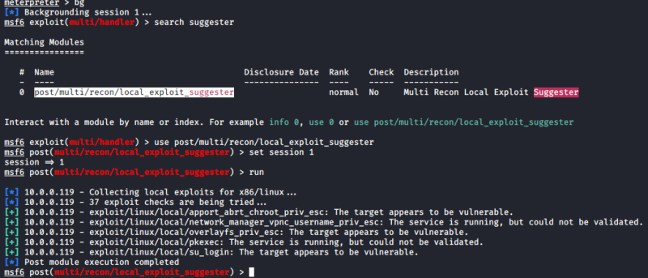
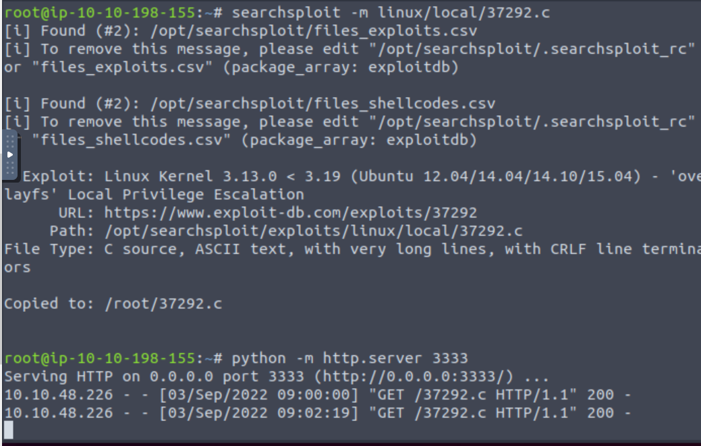
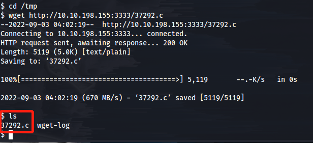
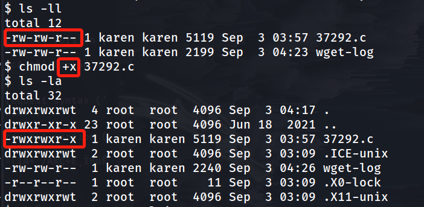
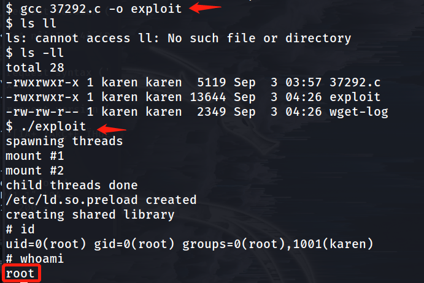
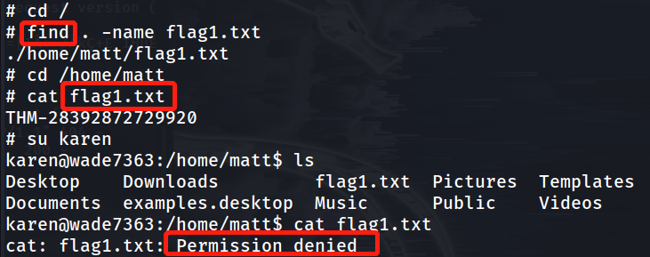

# Linux Privilege Escalation Kernel Exploits | Linux本地内核提权漏洞复现 CVE-2015-1328

@[toc]

# 1. 概述

新技术、高性能技术的不断发展，越来越提升了操作系统的能力，而近几年出现的虚拟化技术，包括overlayfs虚拟层叠文件系统技术，则为docker这样的虚拟化方案提供了越来越强大的技术支撑，但是也同时带来了很多的安全问题，抛开传统的overflow溢出型漏洞不说，还有另一类漏洞属于"特性型"的漏洞，黑客利用系统原生提供的"功能"，加上一些特殊设计的"使用组合方式"，以此实现了非预期的操作结果，甚至root。

这也再次告诉我们，在系统层和黑客进行攻防，就需要比黑客更加深刻理解系统本身的特性，以及在极端条件下它们的组合方式，因为这些组合方式很有可能能够转化为攻击向量



## 1.1 Overlayfs

Overlayfs是一种类似aufs的一种堆叠文件系统，于2014年正式合入Linux-3.18主线内核，目前其功能已经基本稳定（虽然还存在一些特性尚未实现）且被逐渐推广，特别在容器技术中更是势头难挡。它依赖并建立在其它的文件系统之上（例如ext4fs和xfs等等），并不直接参与磁盘空间结构的划分，仅仅将原来底层文件系统中不同的目录进行“合并”，然后向用户呈现。因此对于用户来说，它所见到的overlay文件系统根目录下的内容就来自挂载时所指定的不同目录的“合集”。


## 1.2 漏洞简述

此漏洞源于overlayfs文件系统在上层文件系统目录中创建新文件时没有正确检查文件权限。它只检查了被修改文件的属主是否有权限在上层文件系统目录写入，导致当从底层文件系统目录中拷贝一个文件到上层文件系统目录时，文件属性也随同拷贝过去。如果Linux内核设置了CONFIG_USER_NS=y和FS_USERNS_MOUNT标志，将允许一个普通用户在低权限用户命名空间中mout一个overlayfs文件系统。本地普通用户可以利用该漏洞在敏感系统目录中创建新文件或读取敏感文件内容，从而提升到管理员权限。


## 1.3 风险等级

|  评定方式   | 等级  |
|  ----  | ----  |
| CVSS Score | 7.2 |
| CVSS Score | 9.3 |
| Confidentiality Impact  | Complete |
| Integrity Impact  | Complete |
| Availability Impact  | Complete |
| 实现难度  | 低 |
| 基础权限  | 不需要 |
| 漏洞类型  | 缓存区溢出 |


## 1.4 影响范围

**Ubuntu 12.04, 14.04, 14.10, 15.04 (Kernels before 2015-06-15)**

## 1.5 漏洞详情

参见[CVE-2015-1328 Ubuntu 12.04, 14.04, 14.10, 15.04 overlayfs Local Root](https://www.cnblogs.com/LittleHann/p/4598120.html)

当在上层文件系统目录中创建新文件时，overlayfs文件系统未能正确检查此文件的权限。而这一缺陷则可以被内核中没有权限的进程所利用，只要满足该进程CONFIG_USER_NS=y及overlayfs所拥有得FS_USERNS_MOUNT标志，即允许挂载非特权挂载空间的overlayfs。而这一条件是Ubuntu 12.04、14.04、14.10和15.04版本中的默认配置，所以这些版本的Ubuntu系统都受此漏洞影响。
ovl_copy_up_ 函数未能正确检查用户是否有权限向upperdir目录写入文件。而该函数唯一检查的是被修改文件的拥有者是否拥有向upperdir目录写入文件的权限。此外，当从lowerdir目录复制一个文件时，同时也就复制了文件元数据，而并非文件属性，例如文件拥有者被修改为了触发copy_up_程序的用户。

# 2. 环境配置

***本次漏洞复现采用方案二：线上靶场***

## 2.1 方案一 VMware本地安装配置虚拟机

在[这里](https://ubuntu.com/download)下载处于影响范围内的Ubuntu版本，并再VMware中安装配置。

注：
> - Ping一下，确保主机与靶机之间可以连通
> - 创建一个低权限用户

## 2.2 方案二 线上靶场

这里使用的是[Tryhackme](https://tryhackme.com/dashboard)(一个优秀的渗透学习网站，有部分免费的教程)提供的关于Linux Privilege Escalation练习的虚拟机


# 3. 漏洞复现

***如果是单纯想要了解内核漏洞提权可无视1-2步，从3.3看起即可***

### 整体思路

1. nmap扫描发现ssh服务
2. 暴力破解ssh，得到一个低权限用户
3. 登录靶机，信息收集，识别内核版本
4. 搜索相关版本漏洞exp并下载
5. 利用webshell工具/pythonde的http.sever等多种方法可以将下载的exp上传到靶机
6. 编辑exp权限并运行
7. Bingo！你现在是root了

## 3.1 Namp

使用`nmap -sV -sC -T4 ip`扫描

发现目标开放22端口，运行ssh服务

## 3.2 SSH暴力破解

这里知道存在一个低权限用户：karen

    注：如果是自己配置的虚拟机可以通过`useradd`自行添加一个低权限用户

使用Kali中的Hydra进行暴力破解

`hydra -l karen -P wordlists.txt ssh://ip`

得到用户`karen`的密码为`Password1`，然后通过ssh登录


登陆后查看用户有无sudo权限，发现确实是一个低权限用户



## 3.3 信息收集-识别操作系统和内核信息

关于更全面的Linux基础信息搜集参考[here](https://xz.aliyun.com/t/7924#toc-1)和[here](https://blog.g0tmi1k.com/2011/08/basic-linux-privilege-escalation/)

#### 方法一：手工枚举

这里采用此方法

`uname -a ; lsb_release -a; cat /proc/version /etc/issue /etc/*-release; hostnamectl | grep Kernel`



发现内核版本: `3.13.0`

#### 方法二：脚本自动枚举

这里列举几个GitHub上的工具可以节省枚举时间。

These tools should only be used to save time knowing they may miss some privilege escalation vectors.

因为靶机的系统环境会影响不同工具的使用。如果目标系统上未安装用 Python 编写的工具，将无法运行它。所以最好熟悉一些其他工具

[LinPeas](https://github.com/carlospolop/privilege-escalation-awesome-scripts-suite/tree/master/linPEAS)

[LinEnum](https://github.com/rebootuser/LinEnum)
[LES (Linux Exploit Suggester)](https://github.com/mzet-/linux-exploit-suggester_)

[Linux Smart Enumeration](https://github.com/diego-treitos/linux-smart-enumeration)

[Linux Priv Checker](https://github.com/linted/linuxprivchecker)

## 3.4 查找可用的内核漏洞

这里也有多种方法如:

#### 方法一：Searchspliot

1. 在Kali中使用Searchspliot命令查找相关漏洞

`searchsploit linux kernel x.x.x.x; searchsploit [OS name & version]`

2. 使用`searchsploit -m path/to/exploit/xxxx.c`将搜索到的exp镜像到本地


#### 方法二:  Linux Exploit Suggester

使用 Linux Exploit Suggester自动化脚本可以在目标机器上自动识别可用的内核漏洞




## 3.5 上传并编译漏洞



1. 如上图所示这里在攻击机开启python自带的http.server服务后，就可以使用靶机访问攻击机了，然后`cd`到`tmp`目录使用`wget`命令从攻击机下载准备好的exp，并查看

    

2. 通过`chmod +x exp.c`设置好可执行权限,然后使用`gcc exp.c -o exploit`对exp进行编译，

    
    


## 3.6 执行内核漏洞利用,获取root权限




# 4. 修复建议

1. 根据Ubuntu已经发布的安全公告下载安装相应厂商[补丁](http://www.ubuntu.com/usn/usn-2640-1)

2. 升级系统

3. 临时解决方法：
   
    如果您无法及时升级内核，也不需要使用overlayfs，可以将overelayfs加入黑名单或者直接删除overlayfs.ko或overlay.ko模块文件：
    ```
    modprobe -r overlayfs
    echo "blacklist overlayfs" > /etc/modprobe.d/blacklist-overlayfs.conf
    ```
    注：在一些更老的版本中，该内核模块的名字也可能是overlay。
    可以先用modinfo overlay或modinfo overlayfs来确认准确的内核模块名字。

4. `diff --git a/fs/overlayfs/super.c b/fs/overlayfs/super.c`(待验证)
    ```
    static struct file_system_type ovl_fs_type = {
        .name        = "overlay",
        .mount        = ovl_mount,
        .kill_sb    = kill_anon_super,
        .fs_flags    = FS_USERNS_MOUNT,
        };
        MODULE_ALIAS_FS("overlay");
    ```
# 5. 总结

虽然 Kernel Exploit 通常是一种简单的 提权方法，但它们应该是进行渗透测试时的最后手段，因为它们有会对设备造成破坏，而且很多时候它们只会运行一次。

# 6. References

CVE Details (2020) _CVE-2015-1328_. Available at: https://www.cvedetails.com/cve/CVE-2015-1328/...(Accessed: 29 Sept 2022).


Han Zhang. (2015) 'CVE-2015-1328 Ubuntu 12.04, 14.04, 14.10, 15.04 overlayfs Local Root' *cnblogs*. 25 June. Available at: https://www.cnblogs.com/LittleHann/p/4598120.html (Accessed: 01 Sept 2022).

Miklos Szeredi (2017). *Overlayfs And Containers* [PowerPoint Presentation] 23 March. Rat Hat.