# CVE-2019-1388

[TOC]

# 1. 概述

## 1.1 UAC

***用户账户控制(User Account Control)***

UAC是win10 操作系统中非常重要的安全功能，它起源于 windows vista 操作系统，流行于 windows7、windows8 。各种功能策略得到了完善的修订和开发，应用在 win10 操作系统中，目的是减少恶意软件对系统的侵害。

操作系统默认情况下是启用UAC，当用户运行软件就会触发UAC规则。执行的时候就需要权限，否则是不会运行的。不涉及到更改计算机操作的项目是不会触发UAC规则的，能够触发UAC规则的常用操作包括以下内容：

- 运行应用程序
- 修改注册表文件
- 安装或者卸载程序
- 安装设备驱动程序
- 增加或者删除用户账户
- 复制文件到windows目录

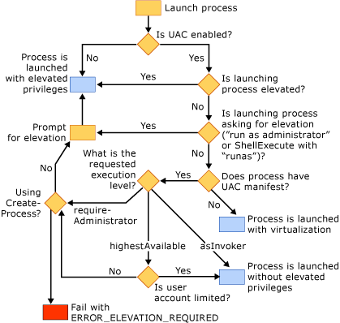

***UAC 的实现***

ACL： windows 中的所有资源都有ACL。给各个程序划定了权限。

在开启了UAC之后，如果用户是标准用户，Windows 会给用户分配一个标准Access Token；如果用户以管理员权限登录，会生成两份访问令牌。一份是完整的管理员访问令牌。（full access token），一份是标准用户令牌。一般情况下会以标准用户权限启动Explore.exe 进程。如果用户同意，则赋予完整管理员权限访问令牌进行操作。

## 1.2 漏洞简述

当 Windows 证书对话框未正确执行用户权限时，它存在一个权限提升漏洞。成功利用此漏洞的攻击者可以在提升的上下文中运行进程。然后攻击者可以安装程序；查看、更改或删除数据。
要利用此漏洞，攻击者首先必须登录系统。然后，攻击者可以运行特制的应用程序，该应用程序可以利用该漏洞并控制受影响的系统。该安全更新通过确保 Windows 证书对话框正确实施用户权限来解决该漏洞。

默认情况下，Windows在称为`Secure Desktop`的单独桌面上显示所有UAC提示。提示本身由一个名为`consent.exe`的可执行文件生成，该文件以`NT AUTHORITY\SYSTEM`身份运行并具有系统完整性级别。由于用户可以与此UI进行交互，因此必须对UI进行非常严格的约束。否则，低权限用户可能能够通过UI操作的迂回路径以`SYSTEM`身份执行操作。即使是孤立地看起来无害的单独UI功能也可能是导致任意控制的一系列操作中的第一步。实际上，UAC对话框已经是被精简到包含最少的可点击选项了。

我们可以通过右键单击任何可执行文件并选择以管理员身份运行来呼出UAC,这将在安全桌面上弹出一个对话框，如下所示：

到目前为止没啥可以利用的，只有 Yes 和 No 按钮、一个密码输入字段和一个 X 按钮。但是那个“显示详细信息”选项呢？

呕吼，这个UI的开口不错哦，我们现在就有了一个指向 Windows 证书对话框的链接：

这就开始有意思了，Windows 证书对话框允许将显示的证书导出到文件中。这将使我们能够访问标准的文件保存对话框，从而打开丰富的 UI 功能。来试试看

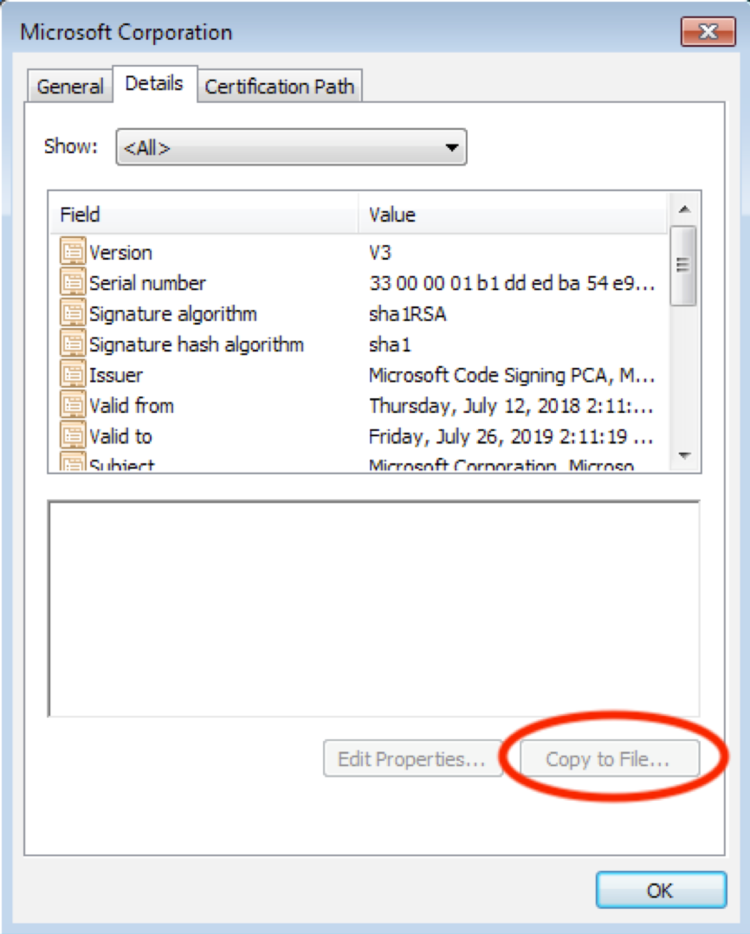

但是现如今微软已经把按钮变灰了

但您可能不了解证书对话框：定义了一个模糊的 Microsoft 特定对象标识符 (OID)，其数值为 1.3.6.1.4.1.311.2.1.10。 WinTrust.h 标头将其定义为 SPC_SP_AGENCY_INFO_OBJID，如果存在，它将在详细信息选项卡中显示为 SpcSpAgencyInfo。此 OID 的语义记录很少。然而，证书对话框似乎解析了此 OID 的值，如果它找到有效且格式正确的数据，它将使用它将“常规”选项卡上的“颁发者”字段呈现为超链接！而当涉及到 UAC 版本的证书对话框时，微软并没有禁用此超链接。

单击超链接将从许可.exe 启动浏览器，该浏览器将以 NT AUTHORITY\SYSTEM 身份运行。奇怪的是，即使浏览器以 SYSTEM 身份启动，但它却显示在普通桌面上，而不是安全桌面上。因此，只有在用户退出所有 UAC 对话框后，它才会变得可见。从攻击者的角度来看，这是一个理想的组合。

那么现在开始今天的漏洞复现吧

## 1.3 风险等级

|  评定方式   | 等级  |
|  ----  | ----  |
| CVSS Score | 7.2 |
| Confidentiality Impact  | Complete |
| Integrity Impact  | Complete |
| Availability Impact  | Complete |
| 实现难度  | 低 |
| 基础权限  | 不需要 |

## 1.4 影响范围

** **

**SERVER** 

|  评定方式   | 等级  |
|  ----  | ----  |
| CVSS Score | 7.2 |

| 系统 | 版本 |
| --- | --- |
| Windows 2008r2 | 7601 |
| Windows 2012r2 | 9600 |
| Windows 2016 | 14393  |
| Windows 2019 | 17763  |

**WORKSTATION** 
| 系统 | 版本 |
| --- | --- |
|Windows   7 |  SP1     7601 |
|Windows   8 |         9200|
|Windows   8.1 |       9600|
|Windows   10 |  1511      10240|
|Windows   10 |  1607      14393|
|Windows   10 |  1703      15063|
|Windows   10 |  1709      16299|

# 2. 环境配置

## 2.1 方案一: Tryhackme线上虚拟环境

## 2.2 方案二: 在VMware中配置的Windows主机，所需文件[HHUPD](./HHUPD.EXE)

# 3. 漏洞复现

## 3.1 信息收集

1. 使用nmap扫描，发现80和远程桌面默认端口3389开放

    `nmap -Pn -sCV 10.10.244.51 -oN nmap.out`

    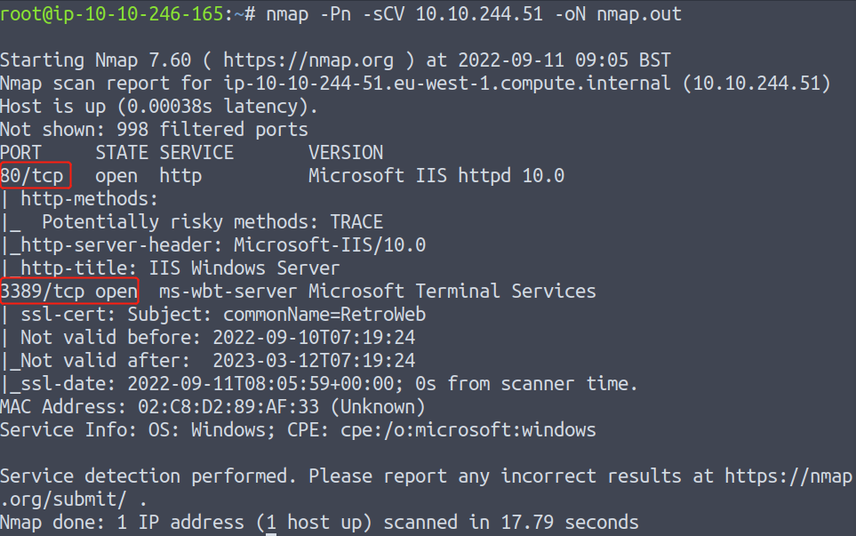

2. 方法一: 使用Gobuster发现网页隐藏目录“/retro”
   
    `gobuster dir -w /usr/share/wordlists/dirb/big.txt -u http://10.10.244.51 -t 50 `

    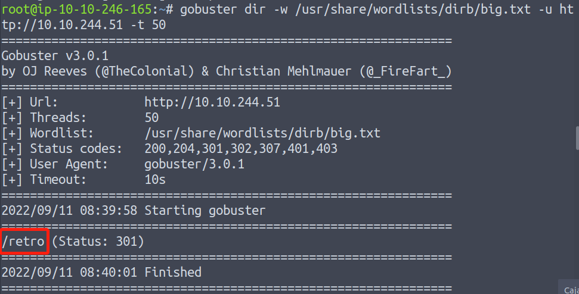

    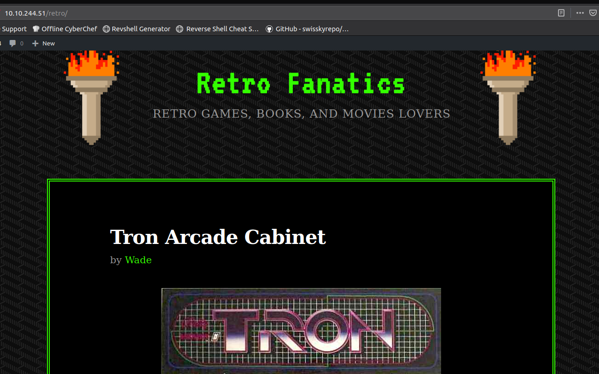

    方法二: 使用ffuf扫描

    `ffuf -w /usr/share/wordlists/SecLists/Discovery/Web-Content/raft-small-words-lowercase.txt -u http://10.10.244.51/FUZZ -ac -c`

    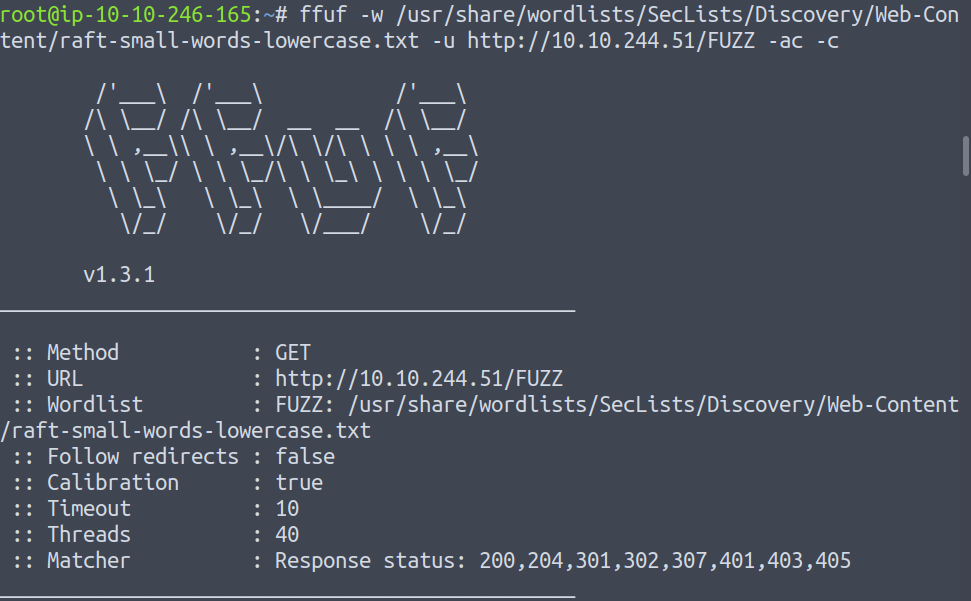

    

3. 对发现的网站隐藏目录进行进一步扫描与探索，应为此网站使用的是WordPress,所以直接使用对应工具wpscan

    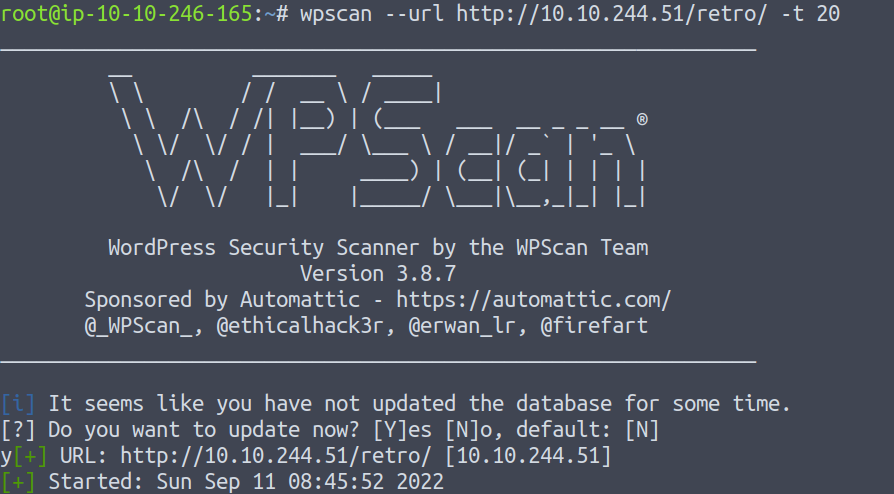

    `wpscan --url http://10.10.244.51/retro/ -t 20`

    识别网站版本及管理页面，可以根据版本检索相应漏洞

    

4. 在浏览探索隐藏网页时发现了有用的信息，经过检验为登录密码
   
    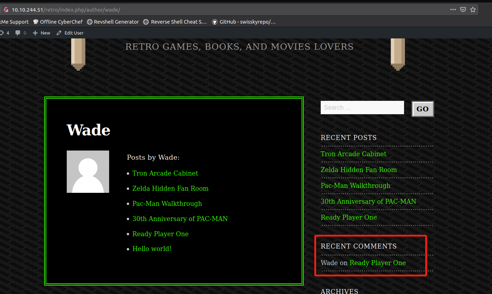

    

5. 使用发现的密码便可以登录网站后台进行操作了
   
    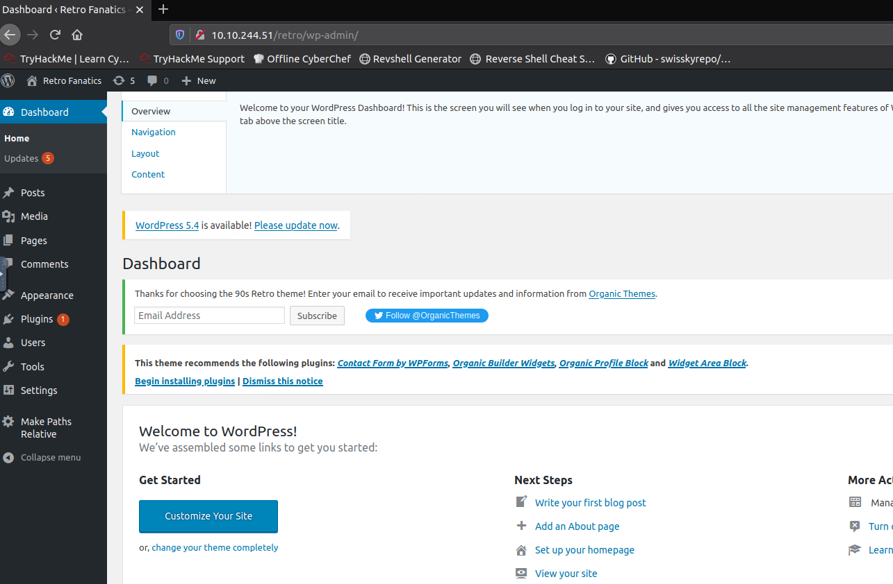

6. 通过上文密码可以进行远程桌面登录，但这里是一个低权限用户需要提权
   
    `xfreerdp /u:Wade /p:parzival /v:10.10.244.51`

    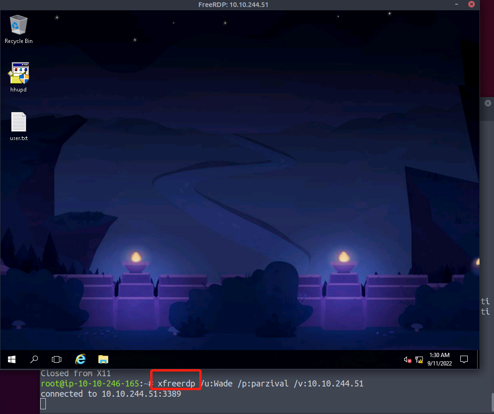

## 3.2 提权

1. 将[HHUPD.EXE]()上传到靶机，或者在配置虚拟机时提前放好

2. 右键点击hudd.exe,并以管理员身份运行，选着更多信息

    

3. 在新跳出的证书页面发现超链接

    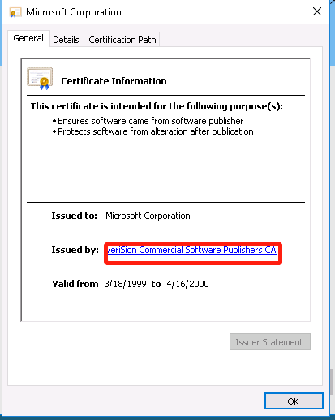

4. 点击打开超链接并退回桌面，发现有网页打开，这里个网页其实是在以管理员权限运行

5. 使用`ctrl` + `s`呼出保存页面

    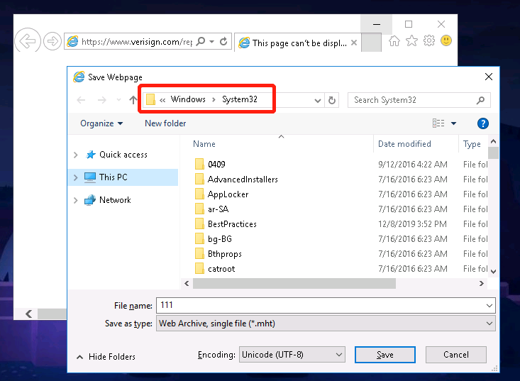

6. 选择进入到系统目录下并保存为cmd，并找到cmd右键打开

    

7. 呼出cmd，查看已经拥有管理员权限

    

# 4. 修复建议

https://portal.msrc.microsoft.com/en-US/security-guidance/advisory/CVE-2019-1388

# 5. 总结

# 6. References

CVE Details (2020) _CVE-2019-1388_. Available at: https://www.cvedetails.com/cve/CVE-2019-1388/...(Accessed: 22 Sept 2022).

东塔网络安全学院. (2021) 'PHP-8.1.0-dev 后门命令执行漏洞复现', _CSDN_, 20 Feb. Available at: https://blog.csdn.net/m0_48520508/article/details/...(Accessed: 22 Aug 2022).
