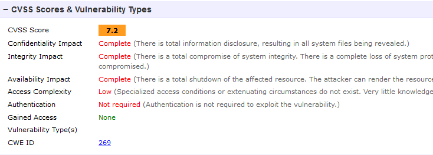

# 标题

[TOC]

# 1. 概述

## 1.1 UAC

用户账户控制UAC：UAC 是 win10 操作系统中非常重要的安全功能，它起源于 windows vista 操作系统，流行于 windows7、windows8 。各种功能策略得到了完善的修订和开发，应用在 win10 操作系统中，目的是减少恶意软件对系统的侵害。
操作系统默认情况下是启用UAC，当用户运行软件就会触发UAC规则。执行的时候就需要权限，否则是不会运行的。
不涉及到更改计算机操作的项目是不会触发UAC规则的，能够触发UAC规则的常用操作包括以下内容：

运行应用程序
修改注册表文件
安装或者卸载程序
安装设备驱动程序
增加或者删除用户账户
复制文件到windows目录

## 1.2 漏洞简述

该漏洞位于Windows的UAC（User Account Control，用户帐户控制）机制中

默认情况下，Windows会在一个单独的桌面上显示所有的UAC提示 Secure Desktop

这些提示是由名为 consent.exe 的可执行文件产生的，该可执行文件以NT AUTHORITY\SYSTEM权限运行，完整性级别为System

因为用户可以与该UI交互，因此对UI来说紧限制是必须的，否则，低权限的用户可能可以通过UI操作的循环路由以SYSTEM权限执行操作，即使隔离状态的看似无害的UI特征都可能会成为引发任意控制的动作链的第一步。

事实上，UAC会话中含有尽可能少的点击操作选项，利用该漏洞很容易就可以提升权限到SYSTEM。

An elevation of privilege vulnerability exists in the Windows Certificate Dialog when it does not properly enforce user privileges. An attacker who successfully exploited this vulnerability could run processes in an elevated context. An attacker could then install programs; view, change or delete data.
To exploit this vulnerability, an attacker would first have to log on to the system. An attacker could then run a specially crafted application that could exploit the vulnerability and take control of an affected system.
The security update addresses the vulnerability by ensuring Windows Certificate Dialog properly enforces user privileges.

当 Windows 证书对话框未正确执行用户权限时，它存在一个权限提升漏洞。成功利用此漏洞的攻击者可以在提升的上下文中运行进程。然后攻击者可以安装程序；查看、更改或删除数据。
要利用此漏洞，攻击者首先必须登录系统。然后，攻击者可以运行特制的应用程序，该应用程序可以利用该漏洞并控制受影响的系统。
该安全更新通过确保 Windows 证书对话框正确实施用户权限来解决该漏洞。

## 1.3 风险等级

|  评定方式   | 等级  |
|  ----  | ----  |
| CVSS Score | 9.3 |
| Confidentiality Impact  | Complete |
| Integrity Impact  | Complete |
| Availability Impact  | Complete |
| 实现难度  | 中等 |
| 基础权限  | 不需要 |
| 漏洞类型  | 缓存区溢出 |

## 1.4 影响范围

** **

#SERVER  
Windows   2008r2    7601        **  link OPENED AS SYSTEM  ** 
Windows   2012r2    9600        **  link OPENED AS SYSTEM  ** 
Windows   2016      14393       **  link OPENED AS SYSTEM  ** 
Windows   2019      17763        link NOT opened 

#WORKSTATION  
Windows   7  SP1     7601        **  link OPENED AS SYSTEM  ** 
Windows   8          9200        **  link OPENED AS SYSTEM  ** 
Windows   8.1        9600        **  link OPENED AS SYSTEM  ** 
Windows   10   1511      10240    **  link OPENED AS SYSTEM  ** 
Windows   10   1607      14393    **  link OPENED AS SYSTEM  ** 
Windows   10   1703      15063    link NOT opened 
Windows   10   1709      16299    link NOT opened

## 1.5 漏洞详情

# 2. 环境配置

## 2.1 方案一

## 2.2 方案二

## 2.3 访问测试

# 3. 漏洞复现

## 3.1 准备工作

### 准备Payload

## 3.2 漏洞利用

# 4. 修复建议

https://portal.msrc.microsoft.com/en-US/security-guidance/advisory/CVE-2019-1388

# 5. 总结

# 6. References

CVE Details (2020) _CVE-2020-9496_. Available at: https://www.cvedetails.com/cve/CVE-2020-9496/...(Accessed: 22 Aug 2022).

东塔网络安全学院. (2021) 'PHP-8.1.0-dev 后门命令执行漏洞复现', _CSDN_, 20 Feb. Available at: https://blog.csdn.net/m0_48520508/article/details/...(Accessed: 22 Aug 2022).
