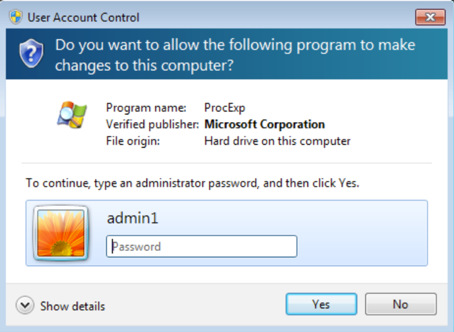
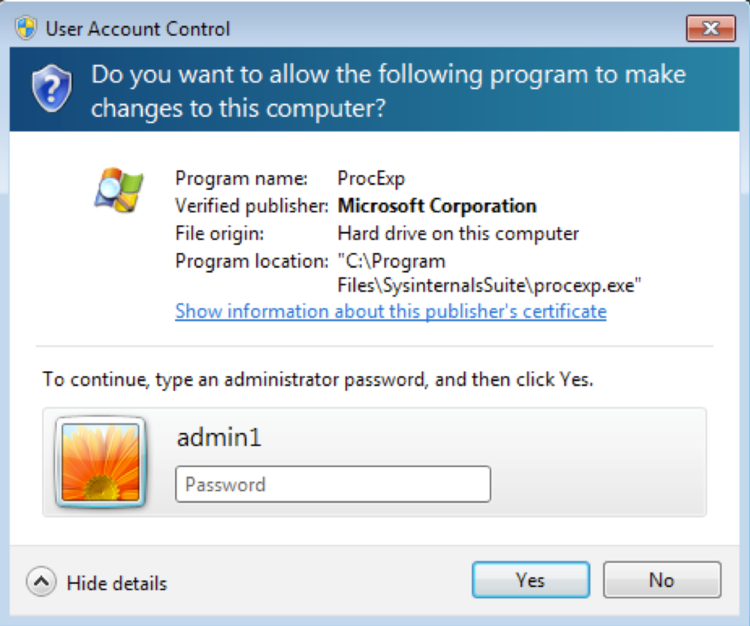

# CVE-2019-1388

[TOC]

# 1. 概述

## 1.1 UAC

***用户账户控制(User Account Control)***

UAC是win10 操作系统中非常重要的安全功能，它起源于 windows vista 操作系统，流行于 windows7、windows8 。各种功能策略得到了完善的修订和开发，应用在 win10 操作系统中，目的是减少恶意软件对系统的侵害。

操作系统默认情况下是启用UAC，当用户运行软件就会触发UAC规则。执行的时候就需要权限，否则是不会运行的。不涉及到更改计算机操作的项目是不会触发UAC规则的，能够触发UAC规则的常用操作包括以下内容：

- 运行应用程序
- 修改注册表文件
- 安装或者卸载程序
- 安装设备驱动程序
- 增加或者删除用户账户
- 复制文件到windows目录

***UAC 的实现***

ACL： windows 中的所有资源都有ACL。给各个程序划定了权限。

在开启了UAC之后，如果用户是标准用户，Windows 会给用户分配一个标准Access Token；如果用户以管理员权限登录，会生成两份访问令牌。一份是完整的管理员访问令牌。（full access token），一份是标准用户令牌。一般情况下会以标准用户权限启动Explore.exe 进程。如果用户同意，则赋予完整管理员权限访问令牌进行操作。

## 1.2 漏洞简述

当 Windows 证书对话框未正确执行用户权限时，它存在一个权限提升漏洞。成功利用此漏洞的攻击者可以在提升的上下文中运行进程。然后攻击者可以安装程序；查看、更改或删除数据。
要利用此漏洞，攻击者首先必须登录系统。然后，攻击者可以运行特制的应用程序，该应用程序可以利用该漏洞并控制受影响的系统。该安全更新通过确保 Windows 证书对话框正确实施用户权限来解决该漏洞。

默认情况下，Windows在称为`Secure Desktop`的单独桌面上显示所有UAC提示。提示本身由一个名为`consent.exe`的可执行文件生成，该文件以`NT AUTHORITY\SYSTEM`身份运行并具有系统完整性级别。由于用户可以与此UI进行交互，因此必须对UI进行非常严格的约束。否则，低权限用户可能能够通过UI操作的迂回路径以`SYSTEM`身份执行操作。即使是孤立地看起来无害的单独UI功能也可能是导致任意控制的一系列操作中的第一步。实际上，UAC对话框已经是被精简到包含最少的可点击选项了。

## 1.3 风险等级

|  评定方式   | 等级  |
|  ----  | ----  |
| CVSS Score | 7.2 |
| Confidentiality Impact  | Complete |
| Integrity Impact  | Complete |
| Availability Impact  | Complete |
| 实现难度  | 低 |
| 基础权限  | 不需要 |
| 漏洞类型  | 缓存区溢出 |

## 1.4 影响范围

** **

#SERVER  
Windows   2008r2    7601        **  link OPENED AS SYSTEM  ** 
Windows   2012r2    9600        **  link OPENED AS SYSTEM  ** 
Windows   2016      14393       **  link OPENED AS SYSTEM  ** 
Windows   2019      17763        link NOT opened 

#WORKSTATION  
Windows   7  SP1     7601        **  link OPENED AS SYSTEM  ** 
Windows   8          9200        **  link OPENED AS SYSTEM  ** 
Windows   8.1        9600        **  link OPENED AS SYSTEM  ** 
Windows   10   1511      10240    **  link OPENED AS SYSTEM  ** 
Windows   10   1607      14393    **  link OPENED AS SYSTEM  ** 
Windows   10   1703      15063    link NOT opened 
Windows   10   1709      16299    link NOT opened

## 1.5 漏洞详情

# 2. 环境配置

## 2.1 方案一

## 2.2 方案二

## 2.3 访问测试

# 3. 漏洞复现

## 3.1 准备工作

### 准备Payload

## 3.2 漏洞利用

# 4. 修复建议

https://portal.msrc.microsoft.com/en-US/security-guidance/advisory/CVE-2019-1388

# 5. 总结

# 6. References

CVE Details (2020) _CVE-2019-1388_. Available at: https://www.cvedetails.com/cve/CVE-2019-1388/...(Accessed: 22 Sept 2022).

东塔网络安全学院. (2021) 'PHP-8.1.0-dev 后门命令执行漏洞复现', _CSDN_, 20 Feb. Available at: https://blog.csdn.net/m0_48520508/article/details/...(Accessed: 22 Aug 2022).
