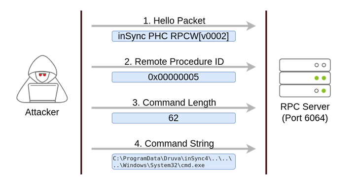
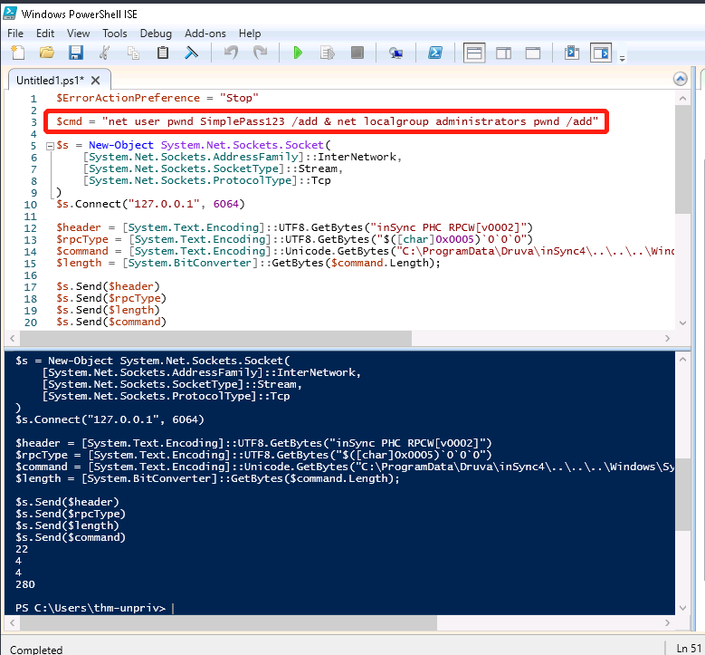
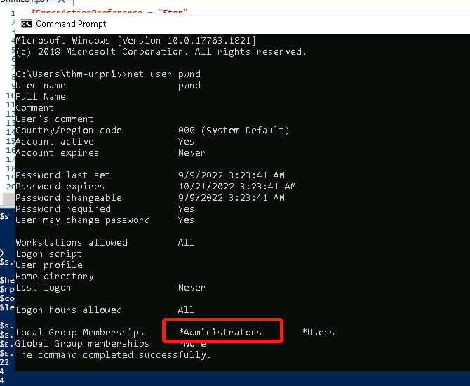
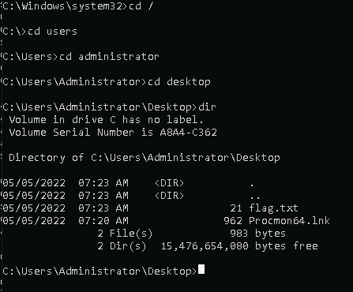

# CVE-2020-5752 Druva inSync 6.6.3 Relative path traversal | Windows客户端下未授权用户的相对路径遍历漏洞复现

[TOC]

# 1. 概述

## 1.1 Druva inSync

Druva inSync™ 是一个 SaaS 平台，通过跨端点和云应用程序以安全合规的方式为用户提供大规模的数据保护、管理和信息治理等服务。更多信息[click here](https://content.druva.com/aws-reinvent-2021/ds-druva-insync)

## 1.2 漏洞简述

Druva inSync Windows Client 6.6.3 中的相对路径遍历允许未经身份验证的本地攻击者以系统权限执行任意操作系统命令。

## 1.3 风险等级

|  评定方式   | 等级  |
|  ----  | ----  |
| CVSS Score | 7.2 |
| Confidentiality Impact  | Complete |
| Integrity Impact  | Complete |
| Availability Impact  | Complete |
| 实现难度  | 低 |
| 基础权限  | 不需要 |
| 漏洞类型  | 目录遍历&代码执行 |

## 1.4 影响范围

**Druva inSync 6.6.3**

## 1.5 漏洞分析

通过 TCP 端口 6064 处理 RPC 类型 5 请求时，inSyncCPHwnet64.exe 在将请求数据传递给 CreateProcessW() 函数之前无法正确验证请求数据。通过发送精心设计的 RPC 请求，攻击者可以将权限提升到 SYSTEM。
具体来说，此漏洞的存在是由于 CVE-2019-3999 的补丁不完整。实施了输入验证以确保只能执行 C:\ProgramData\Druva\inSync4\ 目录中存在的可执行文件，但可以通过使用 ..\ 遍历目录树结构来绕过此逻辑。验证通过，因为可执行路径以 C:\ProgramData\Druva\inSync4\ 开头。

The target server is running Druva inSync 6.6.3, which is vulnerable to privilege escalation as reported by [Matteo Malvica](https://www.matteomalvica.com/blog/2020/05/21/lpe-path-traversal/). The vulnerability results from a bad patch applied over another vulnerability reported initially for version 6.5.0 by [Chris Lyne](https://www.tenable.com/security/research/tra-2020-12).

The software is vulnerable because it runs an RPC (Remote Procedure Call) server on port 6064 with SYSTEM privileges, accessible from localhost only. If you aren't familiar with RPC, it is simply a mechanism that allows a given process to expose functions (called procedures in RPC lingo) over the network so that other machines can call them remotely.

In the case of Druva inSync, one of the procedures exposed (specifically procedure number 5) on port 6064 allowed anyone to request the execution of any command. Since the RPC server runs as SYSTEM, any command gets executed with SYSTEM privileges.

The original vulnerability reported on versions 6.5.0 and prior allowed any command to be run without restrictions. The original idea behind providing such functionality was to remotely execute some specific binaries provided with inSync, rather than any command. Still, no check was made to make sure of that.

# 2. 环境配置

## 2.1 方案一: Tryhackme线上虚拟环境

## 2.2 方案二: 在VMware中配置的Windows主机中安装[Druva inSync 6.6.3](https://downloads.druva.com/insync/)

## 2.3 访问测试

这里架设已经获得一个低权限用户

使用RDP工具连接靶机,这里使用的是xfreerdp

成功连接

# 3. 漏洞复现

### 整体思路

A patch was issued, where they decided to check that the executed command started with the string `C:\ProgramData\Druva\inSync4\`, where the allowed binaries were supposed to be. But then, this proved insufficient since you could simply make a path traversal attack to bypass this kind of control. Suppose that you want to execute `C:\Windows\System32\cmd.exe`, which is not in the allowed path; you could simply ask the server to run `C:\ProgramData\Druva\inSync4\..\..\..\Windows\System32\cmd.exe` and that would bypass the check successfully.

To put together a working exploit, we need to understand how to talk to port 6064. Luckily for us, the protocol in use is straightforward, and the packets to be sent are depicted in the following diagram:

The first packet is simply a hello packet that contains a fixed string. The second packet indicates that we want to execute procedure number 5, as this is the vulnerable procedure that will execute any command for us. The last two packets are used to send the length of the command and the command string to be executed, respectively.

Initially published by Matteo Malvica here, the following exploit can be used in your target machine to elevate privileges and retrieve this task's flag. For your convenience, here is the original exploit's code:

## 3.1 准备工作

1. 信息收集
   
    Software installed on the target system can present various privilege escalation opportunities. As with drivers, organisations and users may not update them as often as they update the operating system. You can use the wmic tool to list software installed on the target system and its versions. The command below will dump information it can gather on installed software (it might take around a minute to finish):

    `wmic product get name,version,vendor`

    Remember that the `wmic product` command may not return all installed programs. Depending on how some of the programs were installed, they might not get listed here. It is always worth checking desktop shortcuts, available services or generally any trace that indicates the existence of additional software that might be vulnerable.

1. 准备Payload

    在上一步我们获得了相关的版本信息，现在可以去检索相关漏洞和利用代码了，比如去如下网站：[exploit-db](https://www.exploit-db.com/), packet storm or [Google](https://www.google.com/)

    参见[payload](./exp.ps1)

    ***注***: 在 $cmd 变量中指定的漏洞利用的默认负载将在系统中创建一个名为 pwnd 的用户，但不会为他分配管理权限，因为我们希望更改负载以获得更有用的东西，所以在现在的环境下我们需要对原Payload中的\$cmd做如下的修改：

    `net user pwnd SimplePass123 /add & net localgroup administrators pwnd /add`

## 3.2 漏洞利用

1. 打开靶机Powershell的IDE，运行准备好的Payload

    

    运行后将创建密码为 SimplePass123 的用户 pwnd 并将其添加到管理员组。

2. 运行以下命令来验证用户 pwnd 是否存在并且是管理员组的一部分：

    ` net user pwnd`

    

3. 以管理员运行cmd，点击more choice选着用户pwnd

    

    

4. 成功

    

# 4. 修复建议

更新到Druva inSync client version 6.6.4 或更高.

# 5. 总结

这是关于Windows提权中关于Abusing vulnerable software方面的简单案列

# 6. 参考连接

https://packetstormsecurity.com/files/157802/Druva-inSync-Windows-Client-6.6.3-Local-Privilege-Escalation.html

https://www.tenable.com/security/research/tra-2020-34

https://tryhackme.com/room/windowsprivesc20