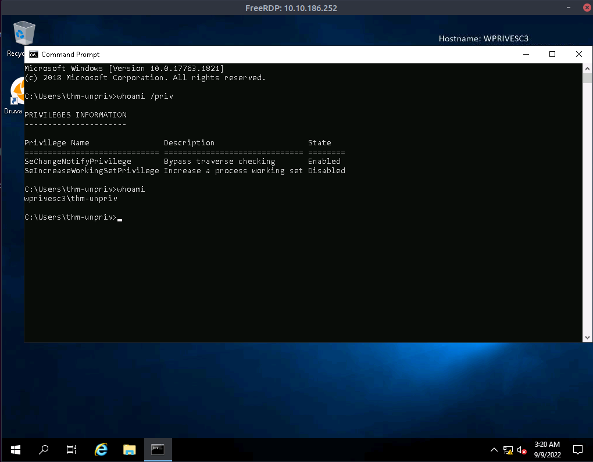
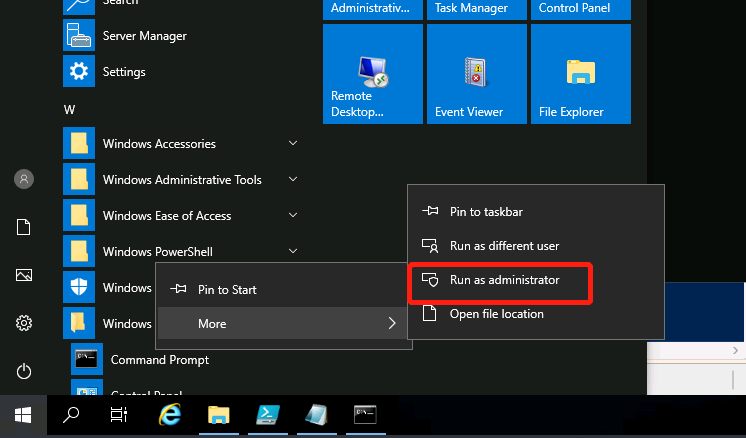

# CVE-2020-5752 Druva inSync 6.6.3 Relative path traversal | Windows客户端下未授权用户的相对路径遍历漏洞复现

[TOC]

# 1. 概述

## 1.1 Druva inSync

Druva inSync™ 是一个 SaaS 平台，通过跨端点和云应用程序以安全合规的方式为用户提供大规模的数据保护、管理和信息治理等服务。更多信息[click here](https://content.druva.com/aws-reinvent-2021/ds-druva-insync)

## 1.2 漏洞简述

Druva inSync Windows Client 6.6.3 中的相对路径遍历允许未经身份验证的本地攻击者以系统权限执行任意操作系统命令。

## 1.3 风险等级

|  评定方式   | 等级  |
|  ----  | ----  |
| CVSS Score | 7.2 |
| Confidentiality Impact  | Complete |
| Integrity Impact  | Complete |
| Availability Impact  | Complete |
| 实现难度  | 低 |
| 基础权限  | 不需要 |
| 漏洞类型  | 目录遍历&代码执行 |

## 1.4 影响范围

**Druva inSync 6.6.3**

## 1.5 漏洞分析

靶机运行版本为 Druva inSync 6.6.3, 最先由 [Matteo Malvica](https://www.matteomalvica.com/blog/2020/05/21/lpe-path-traversal/)发现并报告. 
而这一漏洞又是由 [Chris Lyne](https://www.tenable.com/security/research/tra-2020-12)最初报告的版本 6.5.0 的另一个漏洞应用的错误补丁造成的

在 6.5.0 及之前的版本上报告的原始漏洞允许不受限制地运行任何命令。提供此类功能的最初想法是远程执行 inSync 提供的某些特定二进制文件，而不是任何命令。

该软件易受攻击，因为它在端口 6064 上运行具有 SYSTEM 权限的 RPC（远程过程调用）服务器，只能从 localhost 访问。RPC是一种机制，它允许给定进程通过网络公开函数，以便其他机器可以远程调用它们。

通过 TCP 端口 6064 处理 RPC 类型 5 请求时，inSyncCPHwnet64.exe 在将请求数据传递给 CreateProcessW() 函数之前无法正确验证请求数据。通过发送精心设计的 RPC 请求，攻击者可以将权限提升到 SYSTEM。
具体来说，此漏洞的存在是由于 CVE-2019-3999 的补丁不完整。实施了输入验证以确保只能执行 C:\ProgramData\Druva\inSync4\ 目录中存在的可执行文件，但可以通过使用 ..\ 遍历目录树结构来绕过此逻辑。验证通过，因为可执行路径以 C:\ProgramData\Druva\inSync4\ 开头。

# 2. 环境配置

## 2.1 方案一: Tryhackme线上虚拟环境

## 2.2 方案二: 在VMware中配置的Windows主机中安装[Druva inSync 6.6.3](https://downloads.druva.com/insync/)

## 2.3 访问测试

这里架设已经获得一个低权限用户

使用RDP工具连接靶机,这里使用的是xfreerdp

成功连接

# 3. 漏洞复现

<!-- ### 整体思路 -->

<!-- A patch was issued, where they decided to check that the executed command started with the string `C:\ProgramData\Druva\inSync4\`, where the allowed binaries were supposed to be. But then, this proved insufficient since you could simply make a path traversal attack to bypass this kind of control. Suppose that you want to execute `C:\Windows\System32\cmd.exe`, which is not in the allowed path; you could simply ask the server to run `C:\ProgramData\Druva\inSync4\..\..\..\Windows\System32\cmd.exe` and that would bypass the check successfully. -->

为了实现一个有效的漏洞利用，我们需要了解如何与端口 6064 通信。要发送的数据包如下图所示：

第一个数据包只是一个包含固定字符串的 hello 数据包

第二个数据包表明我们要执行 5 号程序，因为这是一个易受攻击的程序，它将为我们执行任何命令。

最后两个数据包分别用于发送命令的长度和要执行的命令字符串。

最初由 Matteo Malvica 在这里发布，可以在您的目标计算机中使用以下漏洞利用来提升权限并检索此任务的标志。为方便起见，这里是原始漏洞的代码参考[payload](./exp.ps1)

## 3.1 准备工作

1. 信息收集
   
    安装在目标系统上的软件可以提供各种权限提升机会。与驱动程序一样，组织和用户可能不会像更新操作系统那样频繁地更新它们。可以使用 `wmic` 工具列出目标系统上安装的软件及其版本。下面的命令将转储它可以在已安装软件上收集的信息：

    `wmic product get name,version,vendor`

    但有时候`wmic product` 命令可能不会返回所有已安装的程序。根据某些程序的安装方式，它们可能不会在此处列出。检查桌面快捷方式、可用服务或通常任何表明存在可能易受攻击的其他软件的痕迹总是可行的。

1. 准备Payload

    在上一步我们获得了相关的版本信息，现在可以去检索相关漏洞和利用代码了，比如去如下网站：[exploit-db](https://www.exploit-db.com/), packet storm or [Google](https://www.google.com/)

    参见[payload](./exp.ps1)

    ***注***: 在 $cmd 变量中指定的漏洞利用的默认负载将在系统中创建一个名为 pwnd 的用户，但不会为他分配管理权限，因为我们希望更改负载以获得更有用的东西，所以在现在的环境下我们需要对原Payload中的\$cmd做如下的修改：

    `net user pwnd SimplePass123 /add & net localgroup administrators pwnd /add`

## 3.2 漏洞利用

1. 打开靶机Powershell的IDE，运行准备好的Payload

    

    运行后将创建密码为 SimplePass123 的用户 pwnd 并将其添加到管理员组。

2. 运行以下命令来验证用户 pwnd 是否存在并且是管理员组的一部分：

    ` net user pwnd`

    

3. 以管理员运行cmd，点击more choice选着用户pwnd

    

    

4. 成功

    

# 4. 修复建议

更新到Druva inSync client version 6.6.4 或更高.

# 5. 总结

这是关于Windows提权中关于Abusing vulnerable software方面的简单案列

# 6. 参考连接

https://packetstormsecurity.com/files/157802/Druva-inSync-Windows-Client-6.6.3-Local-Privilege-Escalation.html

https://www.tenable.com/security/research/tra-2020-34

https://tryhackme.com/room/windowsprivesc20