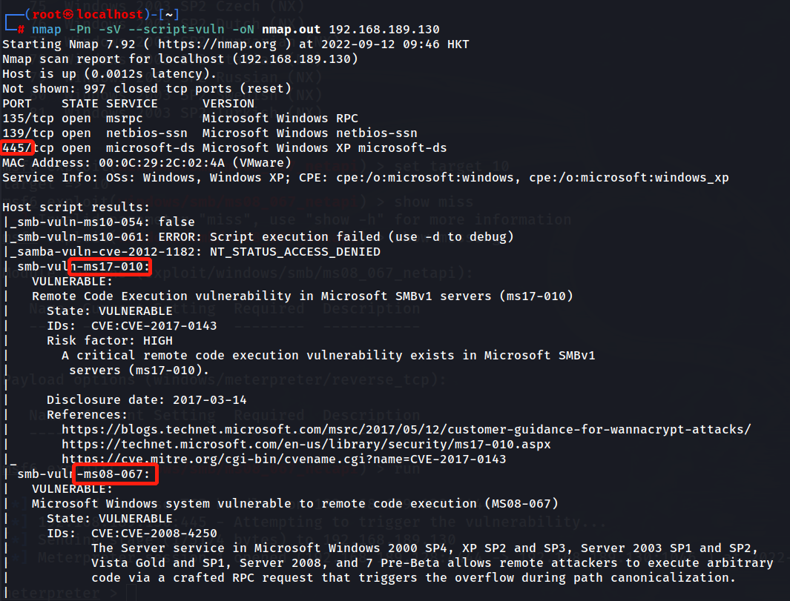
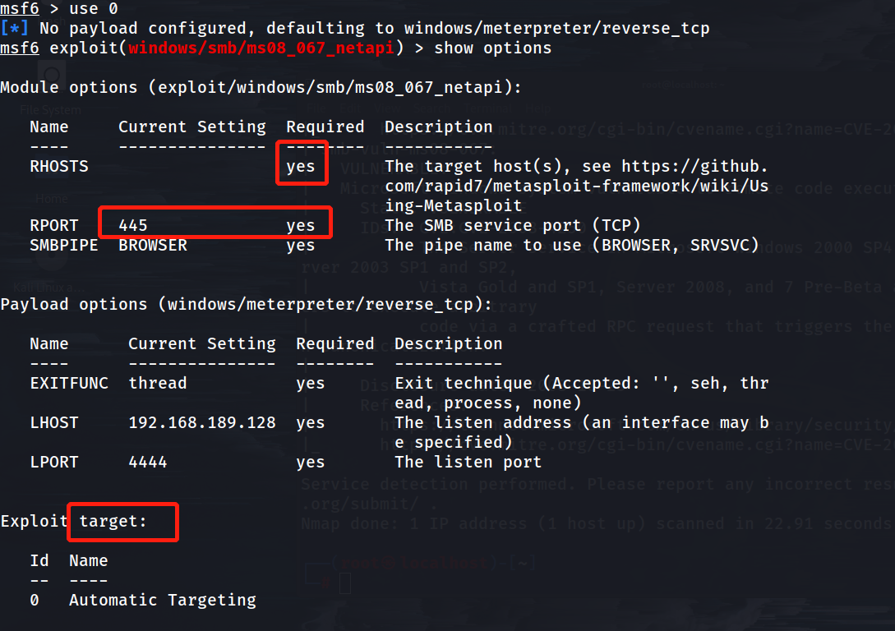
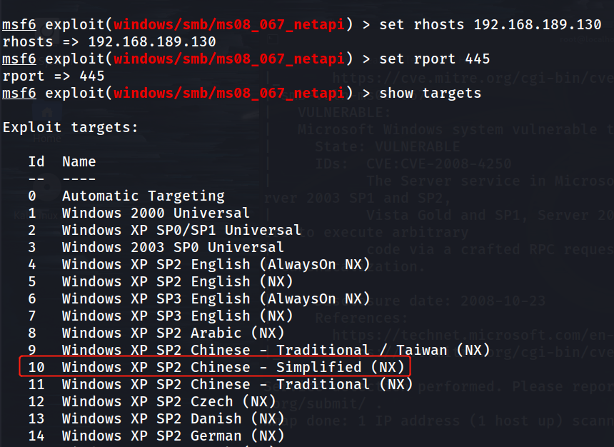
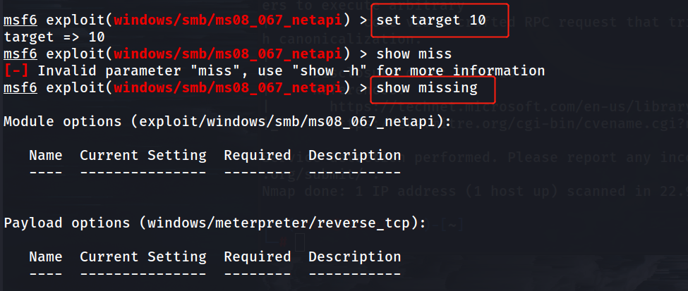
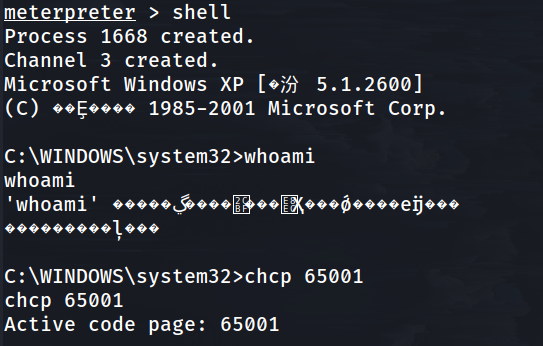
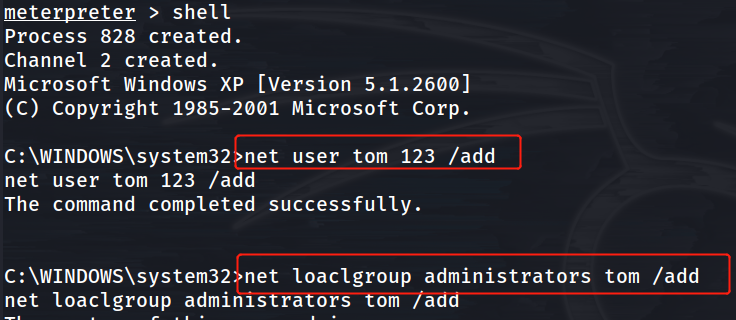
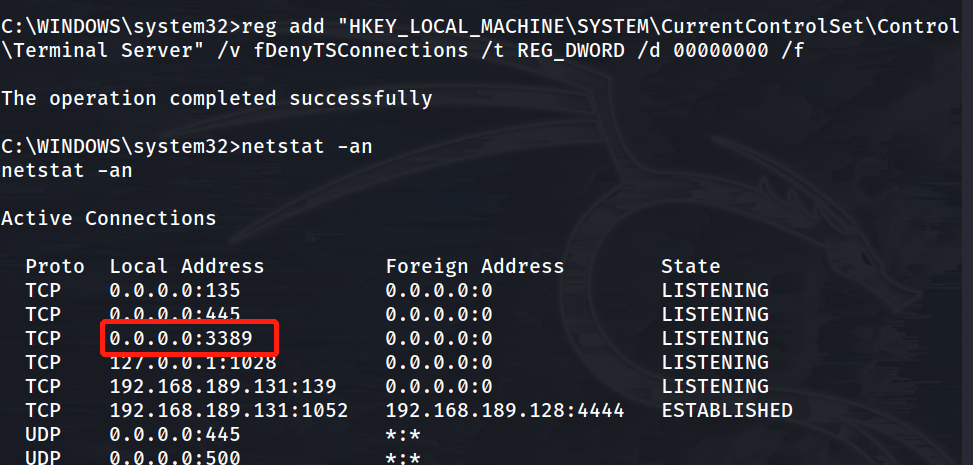

# MS08-067远程代码执行漏洞(CVE-2008-4250) | Windows Server服务RPC请求缓冲区溢出漏洞复现

[TOC]

# 1. 概述

## 1.1 SMB

### What is SMB?

  SMB(Server Message Block)是一个协议服务器信息块，它是一种客户机/服务器、请求/响应协议，通过SMB协议可以在计算机间共享文件、打印机、命名管道等资源，电脑上的网上邻居就是靠SMB实现的；SMB协议工作在应用层和会话层，可以用在TCP/IP协议之上，SMB使用TCP139端口和TCP445端口,SMB使用了NetBIOS的API。

### SMB工作原理是什么？

> 1. 首先客户端发送一个SMB negport 请求数据报，，并列出它所支持的所有SMB的协议版本。服务器收到请求消息后响应请求，并列出希望使用的SMB协议版本。如果没有可以使用的协议版本则返回0XFFFFH，结束通信。
> 
> 2. 协议确定后，客户端进程向服务器发起一个用户或共享的认证，这个过程是通过发送SessetupX请求数据包实现的。客户端发送一对用户名和密码或一个简单密码到服务器，然后通过服务器发送一个SessetupX应答数据包来允许或拒绝本次连接。
> 
> 3. 当客户端和服务器完成了磋商和认证之后，它会发送一个Tcon或TconX SMB数据报并列出它想访问的网络资源的名称，之后会发送一个TconX应答数据报以表示此次连接是否接收或拒绝。
> 
> 4. 连接到相应资源后，SMB客户端就能够通过open SMB打开一个文件，通过read SMB读取文件，通过write SMB写入文件，通过close SMB关闭文件。

## 1.2 漏洞简述

MS08-067漏洞全称是“Windows Server服务RPC请求缓冲区溢出漏洞”，攻击者利用受害者主机默认开放的SMB服务端口445，发送特殊RPC（Remote Procedure Call，远程过程调用）请求，造成栈缓冲区内存错误，从而被利用实施远程代码执行。

## 1.3 风险等级

|  评定方式   | 等级  |
|  ----  | ----  |
| CVSS Score | 10.0 |
| Confidentiality Impact  | Complete |
| Integrity Impact  | Complete |
| Availability Impact  | Complete |
| 实现难度  | 低 |
| 基础权限  | 不需要 |
| 漏洞类型  | 代码执行+缓存区溢出 |

## 1.4 影响范围

**Windows 2000 SP4**

**Windows Server 2003 SP1-2**

**Windows Server 2008**

**Windows Vista SP0-1**

**Windows XP SP1-3**

## 1.5 漏洞详情/原理

MS08-067漏洞是通过MSRPC over SMB通道调用Server程序中的NEtPathCanonicalize函数时触发的。NetPathCanonicalize函数在远程访问其他主机时，会调用NetpwPathCanonicalize函数，对远程访问的路径进行规范化，而在NetpwPathCanonicalize函数中发生了栈缓冲区内存错误（溢出），造成可被利用实施远程代码执行（Remote Code Execution）。后续部分我将分析该漏洞的CFG流程图及漏洞成因。

# 2. 环境配置

|  主机   | 系统  | IP |
|  ----  | ----  | --- |
| 靶机 | Windows XP | 192.168.189.129 |
| 攻击机 | Kaili | 192.168.189.128 |

注：在配置靶机Windows XP或其他受影响的版本时需要打开TCP默认445端口

默认端口3389，CMD命令如下

`REG ADD HKLM\SYSTEM\CurrentControlSet\Control\Terminal" "Server /v fDenyTSConnections /t REG_DWORD /d 00000000 /f`

关闭命令：

`REG ADD HKLM\SYSTEM\CurrentControlSet\Control\Terminal" "Server /v fDenyTSConnections /t REG_DWORD /d 11111111 /f `

# 3. 漏洞复现

## 3.1 准备工作

### 准备Payload

## 3.2 漏洞利用

# 4. 修复建议

# 5. 总结

# 6. References

CVE Details (2020) _CVE-2020-9496_. Available at: https://www.cvedetails.com/cve/CVE-2020-9496/...(Accessed: 22 Aug 2022).

东塔网络安全学院. (2021) 'Apache Ofbiz XMLRPC RCE漏洞（CVE-2020-9496）复现', _CSDN_, 20 Feb. Available at: https://blog.csdn.net/m0_48520508/article/details/...(Accessed: 22 Aug 2022).
